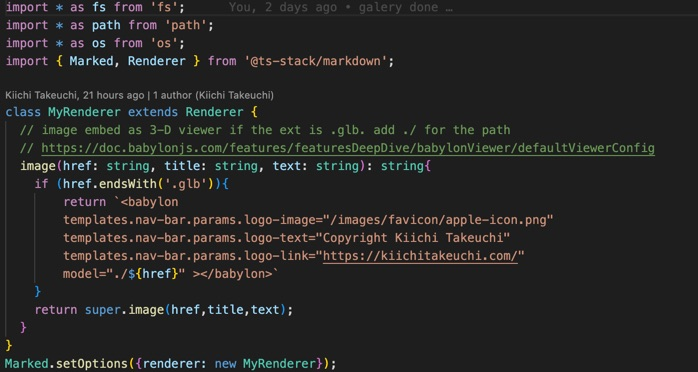
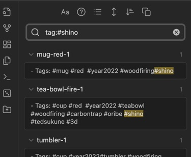
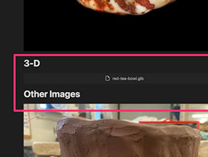
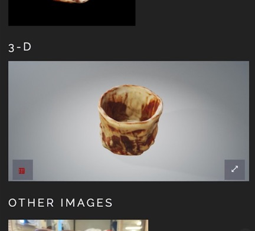

# Building Website Builder

- Date: 2023-01-01
- Tags: #web #blog 



When I was undergraduate student, my instructor of Speech class said this in the first meeting - "Do not start your presentation with an appology." Sorry, I need to start this first article with appology. Although she meant for practical reasons like I should not waste audience's time, I always keep it in my mind. Whoever reads this, my website kiichitakeuchi.com is supposed to be about ceramic art but I am writing this to explain technical aspect of this website because I built this. If you are a potter, probably click go back button for other articles or my works. I'll talk about Mingei movement or Titanium infused curving tools in other pages.

# TL;DR

I start building website builder using Typescript for Obsidian / Markdown as the source.

# Obsession

Since I started learning ceramic art in 2021, I start gathering knowleges and my thoughts. When I was a student, I had been recording all my class notes in my personal wiki. When I was teaching students as Graduate Assistant, one of students came to see me, "Kiichi, did you know there is a website keep updating class notes almost realtime?". 

After I got a job, I setup team wiki server, and then I moved to Confluence. There are many personal notes services; such as, Evernote, One Note, or in modern era, it could be services like Notion, etc... but you know what, the best system for me is "Never Compromised Wordpress", if possible, it stores all data in plain markdown file. I and my wife had used wordpress long time ago. It was fantastic platform. Mature iOS / Web Admin interface. A lot of plugins and themes. Community is so large. Isn't this the most ideal open souce project format? Thus, most of Wordpress "Developer" installed plugins for photo gallery or media management. But this turns to be a catch. Any customization of Wordpress always turns out to be fear of compromising. I and my colleague faced so many "Wordpress hacked" incidents in our life: my personal sites, friend's sites, my company's site, studio mate's portfolios, etc... Just defending Wordpress's fame, it is not about Wordpress. It is the plugin. Plugin are from 3rd party and they often extend to be more powerful feature which is double edge of sward against wild-wide-web attackers. I hoped a simple system. Something I can record quickly and seamless. Practically, I would like to use github as my backup and Cloudflare as the deployment CI.

# Make My Life Easy

Throuout my career, one of my secret for success is to setup myself is to reduce the initial burden for the first step of tasks. This is similar to remove writer's block if you have experience holding final exam paper until last minutes. Just reduce an obstackle before you start writing the first pargraph, it boosts the performance to finish the rest of pages. For example, put a blank sheet of paper with a pen next to your morning coffee mug. The reason I liked about the Wordpress was, it is very easy to start writing something. No hustle to upload image or selection of platforms. Out-of-box good looking theme and their systems allows begginers to write something quickly. This is zero writer's block situation for users.

I always looking for easy way to record my thoughts like my old wiki system. It has to be multi-platform, portable data, and light weight editor system online. First, I was looking into github's Markdown editor for long time. It was nice and evolved over years. I could even drag and drop images. The problem is something I want to automate, such as my "Works" section a.k.a Photo Gallery. I wish I can create mini database which I am able to query later - let's say, "red" "shino", and "mug", then I can search all my files that I created red mug with shino glaze. I thought about start with Google Photo. I used their API via C#, I wasn't like it. I also didn't like I limit the scope only for gallery part, so I needed something more than Photo Gallery generator.

Long story short, our last [Internship](https://riyacherlakola.com/) (literary my last CS internship in my career) told us about how millennials take notes in college nowadays. The tool is called [Obsidian](https://obsidian.md/).  Appearently, it is a markdown editor. What the hell? Why you need other than vi to edit markdown files? Looking into this more closely, Obsidian business is against Cloud-based service model. Wow, don't you guys want to make money by increasing subscription based user's account so that you can inflate EBITDA and Capex? They emphasized keeping everything in flat .md files. My colleague quickly gave me a lot of tips since he was already heavy user. Okey, their counter-marketing propaganda for geeks worked for me.



Obsidian has minimalistic WYSWIG editor; however, it's powerful. The editor has to accept  images that I grab from somewhere else. One of the biggest feature is that I can specify image location when I drag and drop. Yeah, this is not for begginers. You need to be a bit geek to use this tool, but if you are, this takes off your editing process but it wouldn't overwhelm your brain.

# Reliability

When I launch a new project, I always ask my team how reliable to maintain the project. How long you can support the project? 2 years? 5 yerars? or even 10 years? It is same thing for my personal project. How long Obsidian keep the support? Well, it will be markdown editor after all. I don't need their support in the worst case. By the way, many people pitch a lot of plugins and ecosystems in Obsidian community, but I should not rely on them. That is why I start building a website builder just for myself without depending on somebody's plugin. I just bought their basic editability and search function (well, I still didn't pay for pro plan though).

What I afraid in next 20 years is something I stop blogging or updating because of those technical dependency or risk. I have basic programming skills to build something from the scratch, so my choice is much wider than other people. What if Markdown died then? I just need to write another data  migration tool for it. It is just text files with dash or hash.

# Even More, Technical Notes

Below are technical notes to put my thought process together. A lot of Obsidian's Plugins exist using their API as the [solutions](https://github.com/KosmosisDire/obsidian-webpage-export); however, I wanted to build html builder without Obsidian's API dependency. I could be wrong but looks everything is straight forward even their canvas and graph by looking at their simple metadata. For Markdown to HTML, I decided to chose [ts-stack/markdown](https://github.com/ts-stack/markdown) . I have used Showdown, and other minimalistic md to html converters (or built my own), but this library convinced me to install another package. One of the best features of this library meets my major requirement. I wanted customize what I drag and drop into Obsidian which often appears as link notation.



I start scanning my ceramic arts using [photogrammetry app](https://metascan.ai/) then I kept them as .glb or .gltf files. Luckily, [Babylon.js](https://www.babylonjs.com/) 's autoloader does fantastic job to render .glb files. After I discovered both, I [quickly implemented](/works/2022/cups/tea-bowl-fire-1/tea-bowl-fire-1.html#3-d) custom renderer class in the markdown converter to just embed ```<babylon></babylon>``` tag in the code.  LIke those customization, aggregating with existing static files and assets, I decided to use rsync. I kept my Obsidian repo in iCloud (clean without html files), just running rysync and run build commend via npm will deliver fast publishing. The rest of process should be just commit all static files into my git repo, then CI and Cloudflare will take care the rest (that's why you see this post now!).



You can imagine, I would integarate Youtube embed from those links. Impotant part for me  was to use minimalistic tool set but they have to be flexible enough.


# Possible Closing Comment

- iCloud - win
- Obsidian (Free) - win
- Typescript and other technology stack - okey
- Github and Cloudflare - yey

My next step? I would integrate [markmap](https://markmap.js.org/) or [Cytoscape.js](https://js.cytoscape.org/). 

# References

- [k-obsidian-export/k-export.ts at master · kiichi/k-obsidian-export](https://github.com/kiichi/k-obsidian-export/blob/master/k-export.ts)
