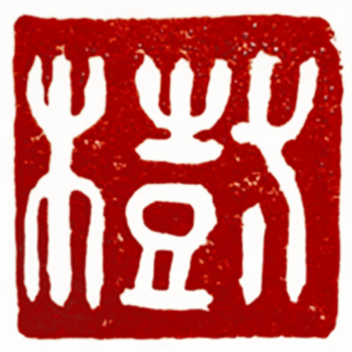
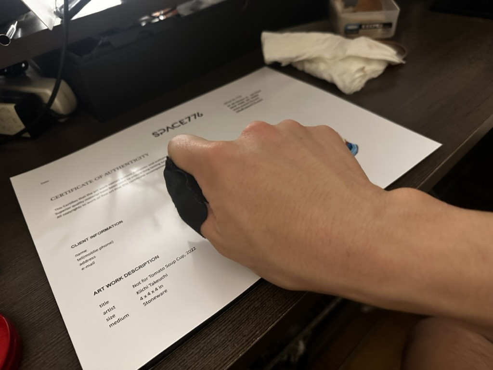
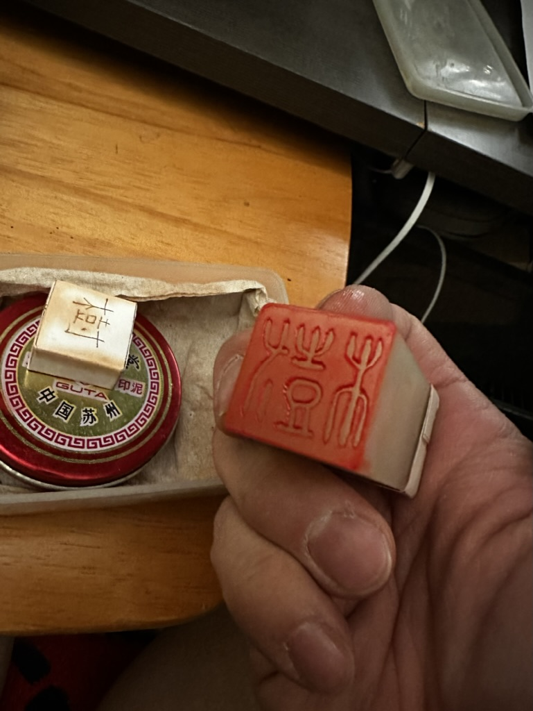
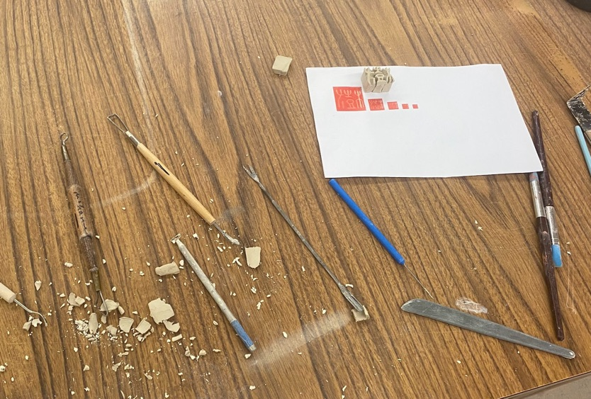
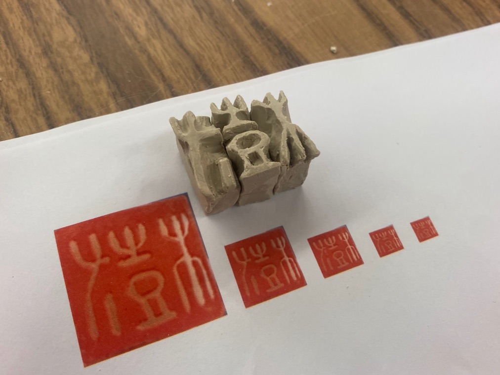
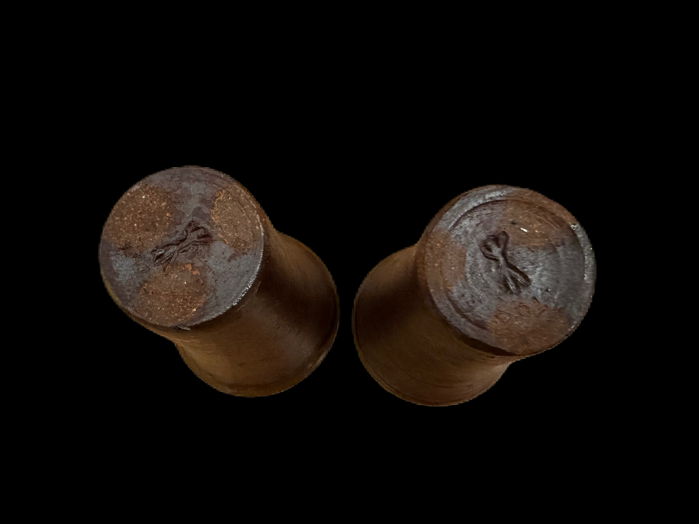

# About My "Ugly" Maker's Mark

- Date: 2023-01-02
- Tags: #pottery #japanese #bio #blog #kanji #makersmark

All my works have certain big "ugly" maker's marks since I started in 2022. I put this on the side of my works where it is obviously visible because it is oversized in most of cases. Yeah, I don't hide who I am. I agree that this is part of my ego, and I am trying to expose myself at the same time. But hey, I should know that individual artist needs to express himself by his own work, not by his signature, right? I probably heard somebody told me "find your voice" at least half dozen of times after I started BFA programs since last year. 

# What is this maker's mark mean?

Anyways, I consider stamping my big maker's mark is part of my art process. I believe a word, "artist", is farely new concept in modern era. I carefully avoid opening religious discussion: between Fine Art v.s Craft or Individualism in 65 billion dollers art market. So let me put this way: I keep building (and stamping on them), it's like footprint 1 of my progress. 

Just like other potters who signs their works, I took my first character of my name, Ki (樹), as the design. My name, *Kiichi*, consists of two Kanji characters: 

- 樹 = "Ki" and　
- 一 = "ichi". 

I was named with *ichi* post-fix. English speaker might know famous Japanese phrase "Ichi-ban" ; means, Number One. I got ichi because I am the first child for my parents. Ki part looks complicated in Kanji / Chinise character, but what it represents is a big tree. Wishful thinking of my parents didn't help my height (5' 6'') to grow after highschool. I need a long step on the floor to wedge a lamp of clay.

# Design

The original stamp is created by *The Unknown Craftsman 2* in Beijing when my father traveled there in 90s. I often stamp the original one for paper documents. I brought this to the U.S when I came over here in 1998. Since then, I never had a chance to use until I start building my ceramic art.

# Making

I created a block of porcelain like 1 inch cube, then I decided to split into 3 pieces. First I splitted them because it was easier to curve, but soon I noticed this is easier when I stamp on the side of curved surface. I couldn't create a small neat maker's mark like Florian Gatsby 3.

For small bowl or tumbler, I just take one left most piece. Surprisingly, the small part still represent original meaning of my name, a regular size tree.

# Footnotes

1. Vonnegut, K. (2011). _Breakfast of champions [or Goodbye blue Monday!]_. Dial Press Trade Paperbacks. (Original work published 1973) Page 206
     *Trout Says in the book when he is making footprint with his wet feet: "I am simply using man’s first printing press. You are reading a bold and universal headline which says, ‘I am here, I am here, I am here.''"*
2. Yanagi, S., & Leach, B. (1978). _The unknown craftsman : a Japanese insight into beauty_. Kodansha International.
3. I met Florian in 2022 when he did residency / demo at Southampton in NY. He kindly showed me the collection of his maker's mark with hand crafted leather case. He throws bowls super thin, so obviously, he needed to create tiny "F" to mark on the foot.