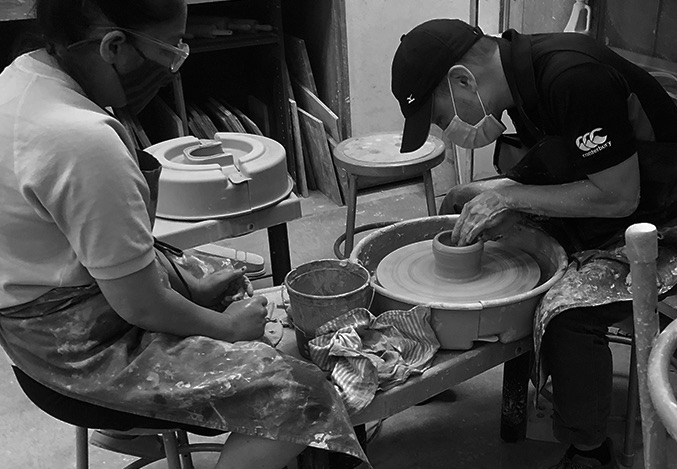
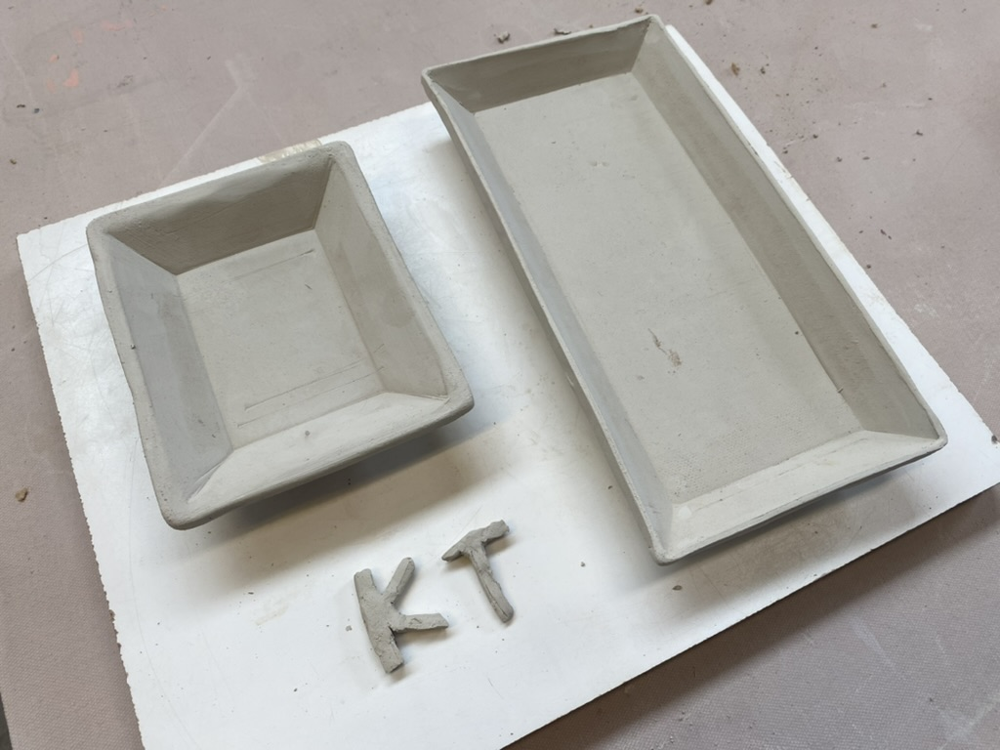
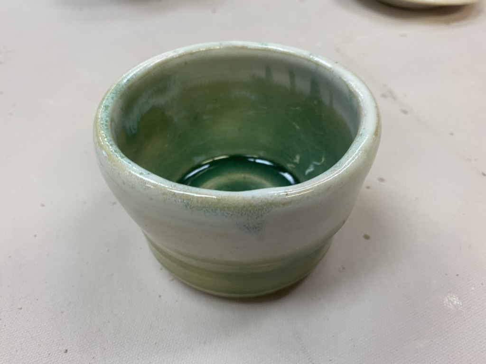

# Do you know about your hands?

- Date: 2023-01-03
- Tags: #pottery #brooklyn #blog #bio #potter

I like to listen to how other people started pottery. My favorite story is that of Malcom Davis, who left his mark as the famous Malcom Davis Shino. Most studios that do cone 10 reduction firing likely have his recipe in a bucket. Although he makes his story funny, it's true that he started making pots after the age of 40.

As for my case, when we were about to reach a milestone for our startup (though it's no longer a startup after 10 years), I explored other interesting areas in computing, such as machine learning and quantum computing, for my personal learning.

My wife decided to go back to finish her BFA degree after the first wave of the pandemic in 2020. Although I had an interest in ceramic arts, I had never tried it before. While waiting for her, Johnna Woods, an adjunct professor at the Brooklyn Campus, approached me. Knowing that I was an administrator on campus, she invited me to the ceramic studio to make something. Later, I realized that creating a welcoming atmosphere is common in ceramic art. My wife often tells me, "You're lucky to be in ceramic art. Other categories, especially photography, are not like that." I hope I'm not offending other art categories, but I believe this sense of community is remarkable in ceramics. Another professor, Frank Olt, at the Post campus, shared the same philosophy with me later on: "Ceramic artists should not work alone. Our philosophy is to work together, clean together, and eat together."

When she taught me wheel throwing for the first time, she asked me a question: "Do you know about your hands?" This was just an introductory talk to let students know that everyone is different, so they should spend time finding their own way after her demonstration. Somehow, I took her question as a philosophical one. I had been building programs with my hands for more than 20 years, but I had never paid attention to how they looked. Surprisingly, the wet clay changed forms in a much more dynamic way than I expected on the wheel. This brought me into a more conscious and interactive process directly with my fingers and palms. This topic is connected to a conversation I had with Florian Gatsby when I met him in the summer of 2022, and we talked about the shape of the thumb. Everyone has different hands, and all pots reflect oneself, whether one is skilled or not. Of course, as a beginner, I spent a sweat amount of time just centering the clay. Paul Soldner said, "Accept your mistake; it is your personality." I initially took his words positively, then I noticed that personality in artwork is such a cruel topic to discuss. Most ancient artists didn't put their names on their work. I have no doubt that we have evolved to emphasize individualism along with materialism. While potters often throw imperfect-shaped teabowls, Toto has invented the ultimate unseptic ceramic toilet bowl.

It seems that I always fall into the pitfall of the discussion between Fine Arts versus Craft. I am not one of those people who engage in endless fights in the studio. Instead, I would like to introduce my favorite question: "What do you use it for?" This is a great question to ask in a classroom because it redirects students' attention to a goal-oriented approach.

In closing, the first photo shows me throwing my 2nd or 3rd pot, which I still keep in my kitchen and look at every day. It's an okay shape because Johnna helped me fix it, but the bottom is too thick. It's a typical beginner's bowl and I like it because it is useful for holding my dishwashing brush near the sink.

