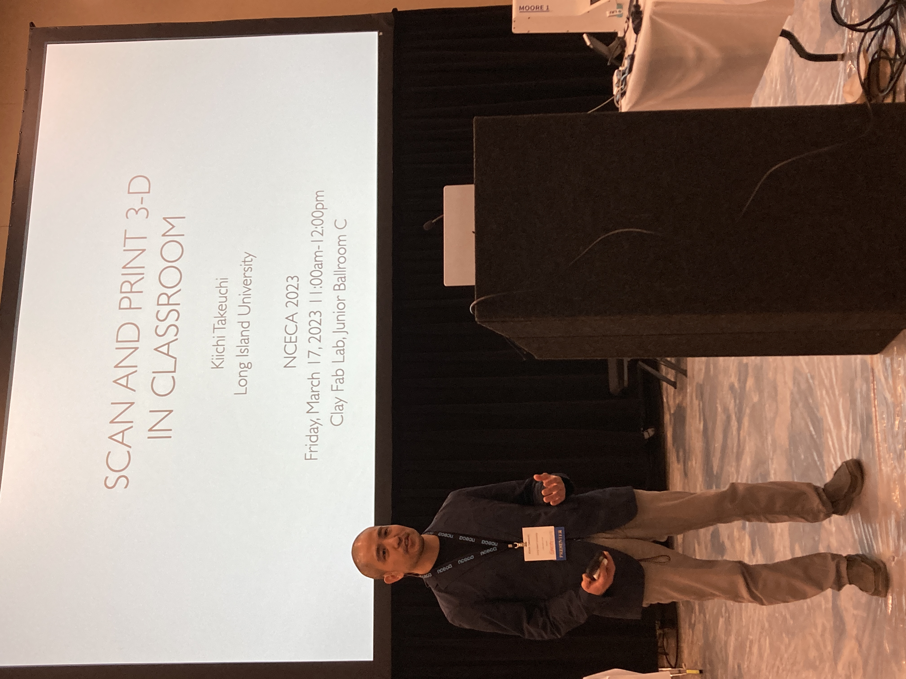
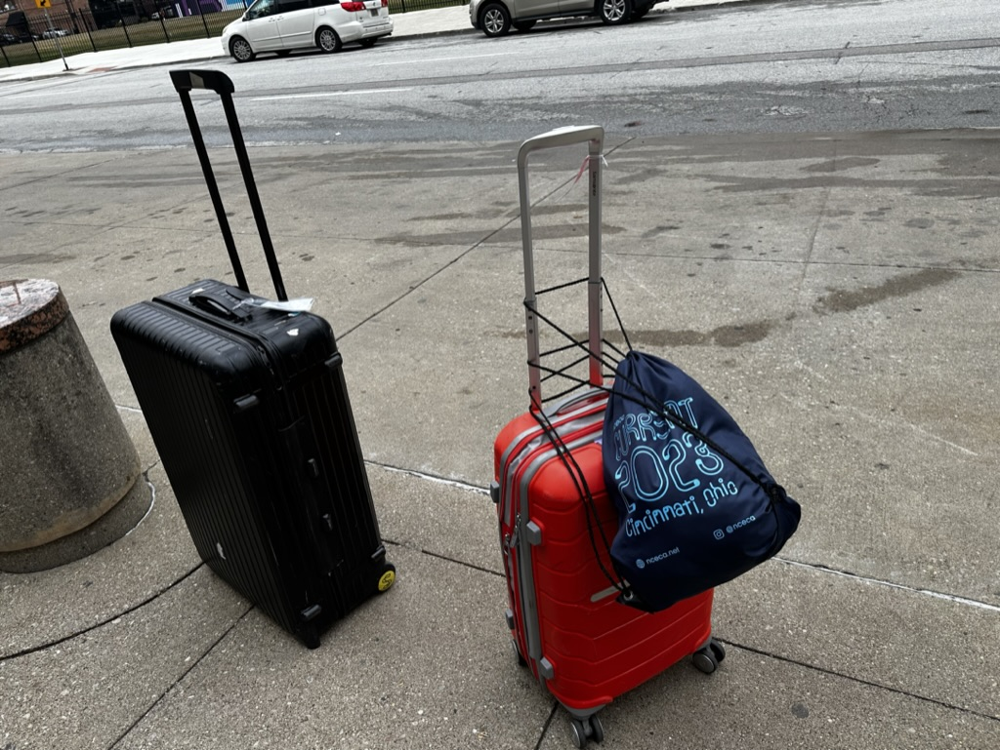
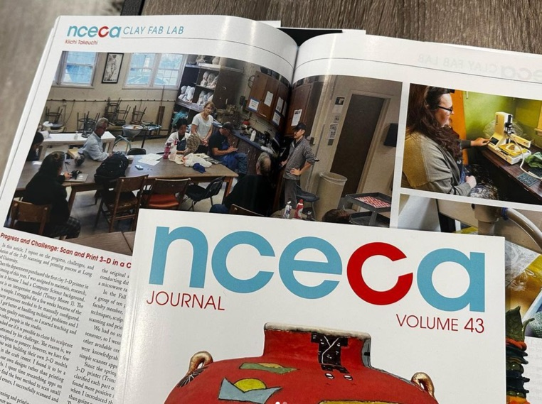
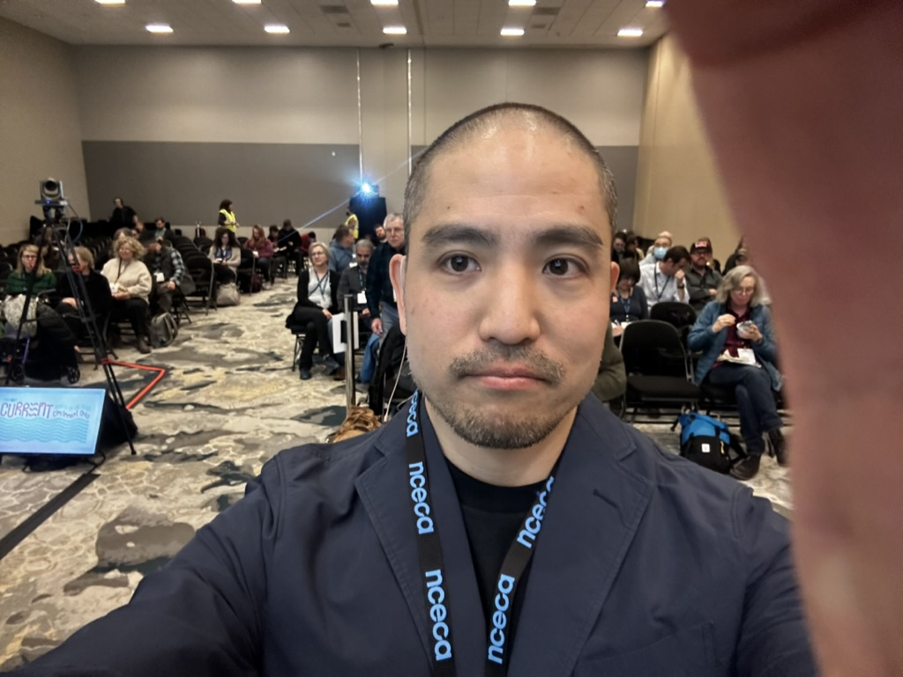
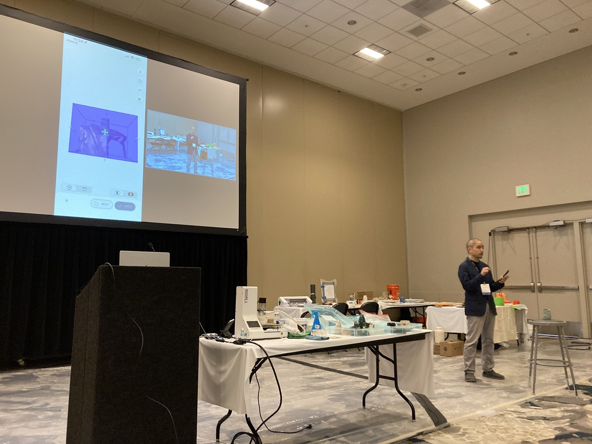
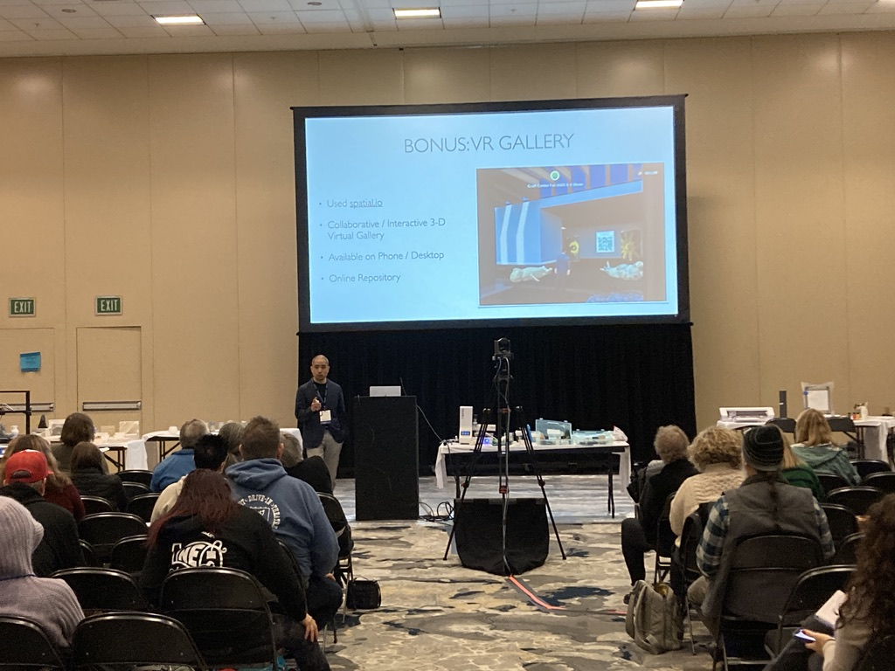
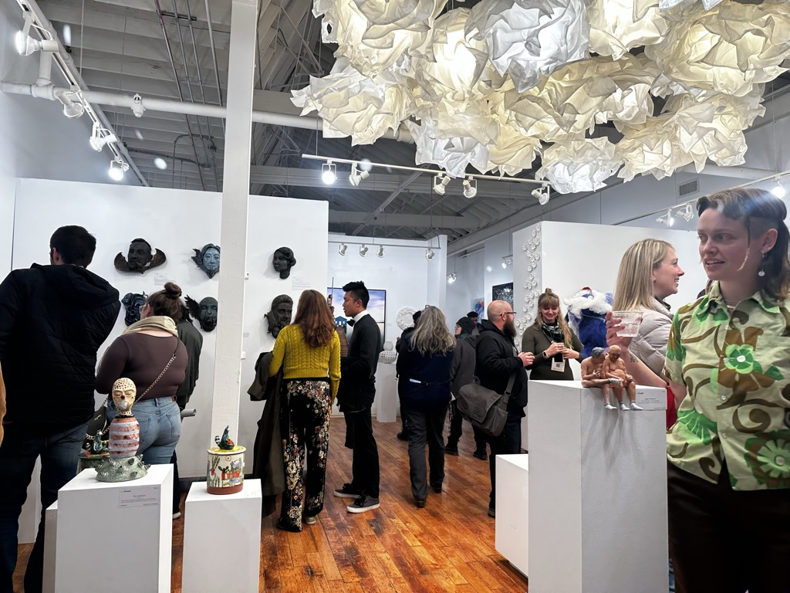
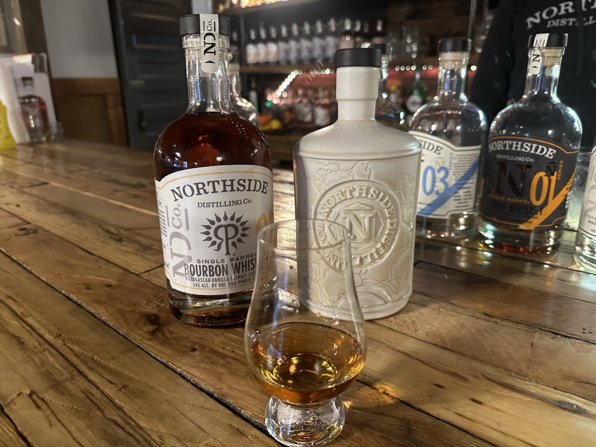

# Presenting at NCECA 2023

- Date: 2023-03-17
- Tags: #pottery #blog #nceca #conference #demo #workshop

To be honest, I didn't know what I signed up when my proposal for presentation was accepted in the spring of 2022. When I started to learn ceramic art in 2022, I asked my instructor, Johnna Woods, any conferences which I can attend. Reading journal and attending conference are my common activities when I enter into new field. I enjoy interacting with academia or other professionals to discuss specific topics of my recent interests. But this time, ceramic art, is totally new and this is one of catetegories far from technology. Around that time, Frank Olt, who is the director & tenure faculty member at Long Island University, purchased the 3-D "clay" printer.

After the conference, we went out for gallery crawl and driniking. 

I found a local distriller, Northside, which collaborated with local potter to make special batch for the boutique bourbon.

# SNS Posts

https://www.instagram.com/p/Cp2aFlnAuqP/ 

https://www.instagram.com/p/Cp6A5UiO49Q/

https://www.instagram.com/p/Cp5A8u5gfCc/

https://www.instagram.com/p/Cp0q3OeAPVI/