# Woodfiring, February 2023

- Date: 2023-04-07
- Tags: #pottery #blog #woodfiring #beluga

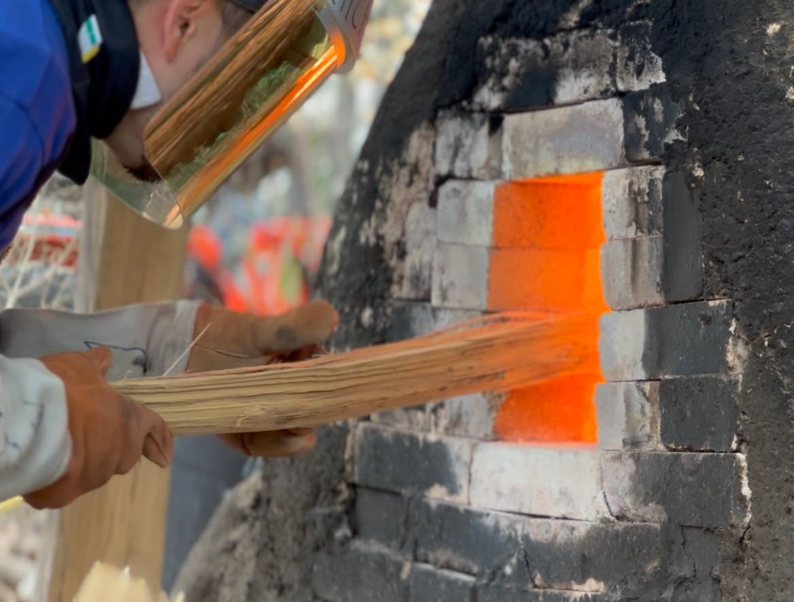

This is my fourth wood firing at Trevor Youngberg's kiln yard. This time, we fired in the recently-built Beluga Gama, which was constructed with firebricks donated by Long Island University. The size of the kiln is about 33 cubic feet, making it sufficient to host the work of 10 potters. I had a few goals for this firing.

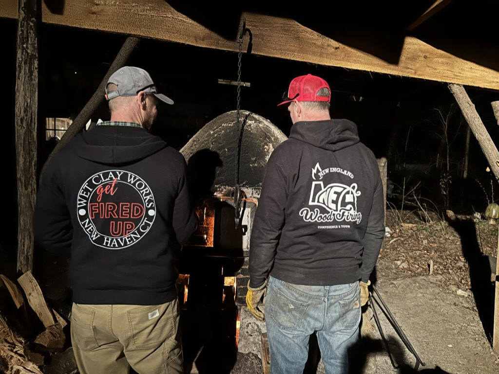

## Works from February

First, I wanted to fire the remaining works from the previous firing. The results came out very differently, as always, and my sushi plate with the same yellow salt glaze had a totally dynamic surface with lots of melted pine wood ash.

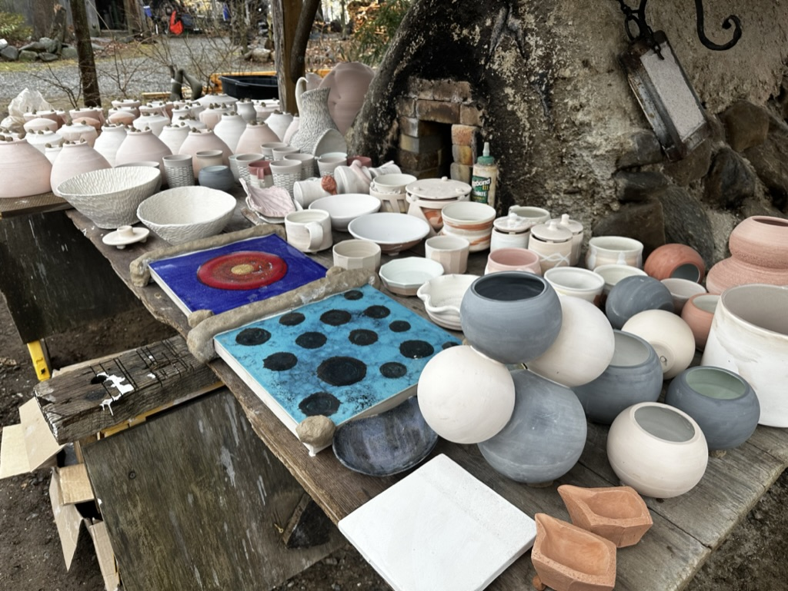

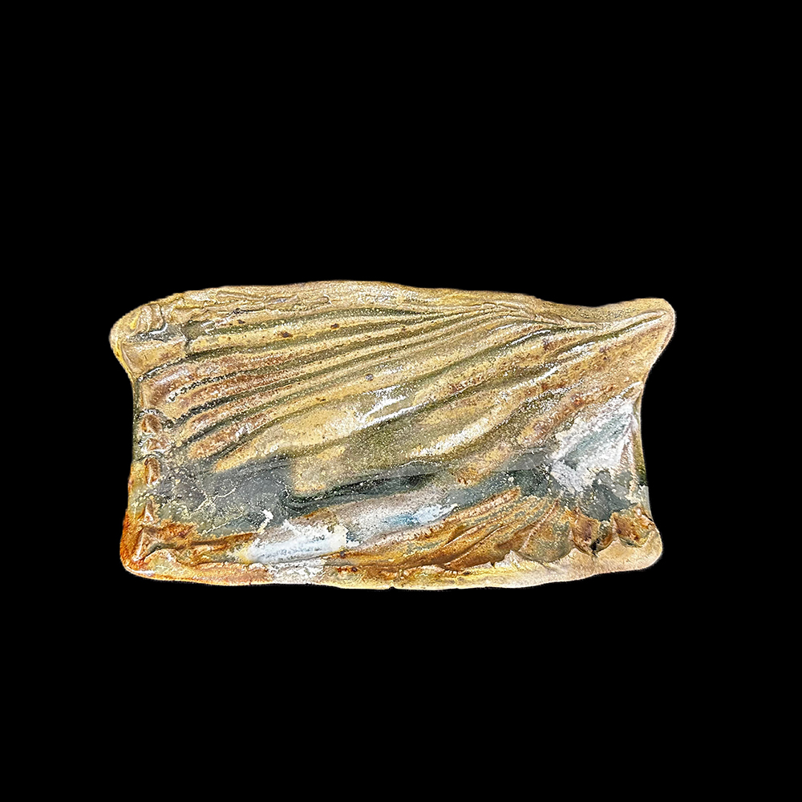

Another yellow salt glaze piece is shown below. During this firing, some white material melted and dripped onto the surface, creating a beautiful halo effect. This was an unexpected and fortunate accident, and I may try to replicate it intentionally in future firings by splashing a similar material onto the piece.

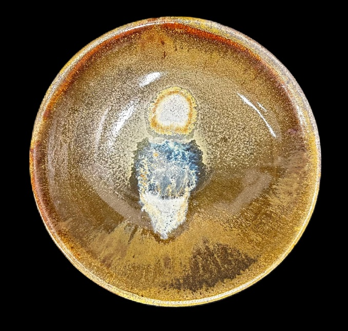

# Wild Clay

Secondly, Professor Foster at Long Island University gave me a wonderful gift. When she walked to the private beach at Glencove, she picked up a few chunks of clay for me. It was an odd moment when I thought about it because who shows such big appreciation for a guy receiving a chunk of mud (it's not like chocolate for my birthday). Well, this is how I can describe how my life has been transformed in the ceramic studio. Anyways, since I bought the book "Wild Clay" by Mr. and Mrs. Shibata, who moved from Shigaraki to North Carolina, I wanted to try processing wild clay.

Either throw something or make slip from it, at the very least. Professor Rothental showed me a similar example last year when he applied a slip from a river basin in Florida.

The clays from Northshore Long Island have different characteristics such as black, gray, yellow, and white. However, when fired, everything turned white except for the yellow one. Many shiny, mica-like speckled spots were observed in my test tiles, indicating that the yellow clay probably contains some iron.

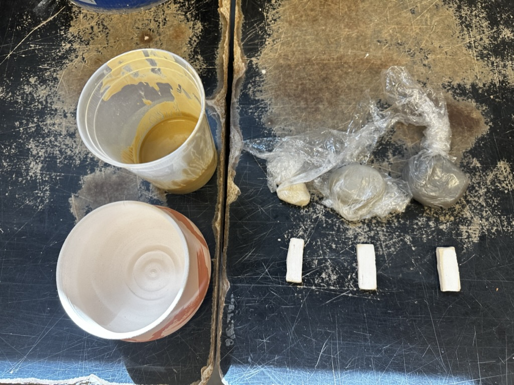

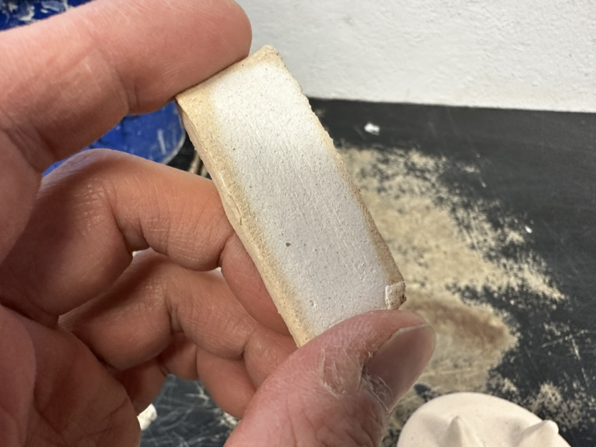

# Kimono Saggar

The third idea I had for this firing was my new concept, the "Kimono Saggar", or perhaps it would be more accurate to call it the "Bikini Saggar". When I saw the effect that the flame had on the pots of other potters in the kiln, I realized that it was impacted by the direction of the flame. This led me to consider a hypothesis: if ceramic art is the art of fire, then could I capture the flame's effect by creating a saggar with slits or holes? Could I even aim to control the surface area that receives ash by placing my pots near the firebox?

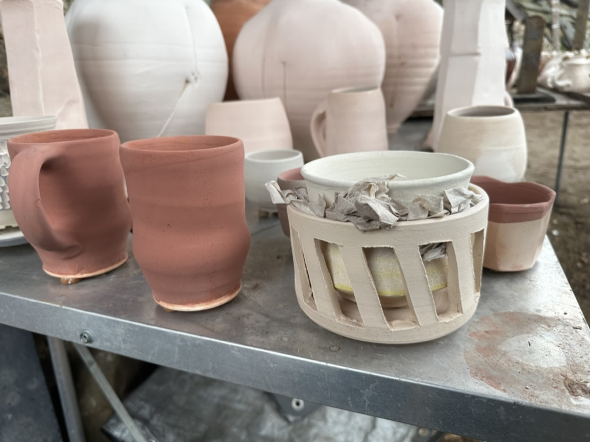

We cannot put our hands on our pots to paint them when the Anagama is at 2300°F, but I might be able to create a ceramic stencil to shape the flame. Just like Banksy sprays using a stencil on a wall, I wanted to make marks on my pots using a slitted saggar.

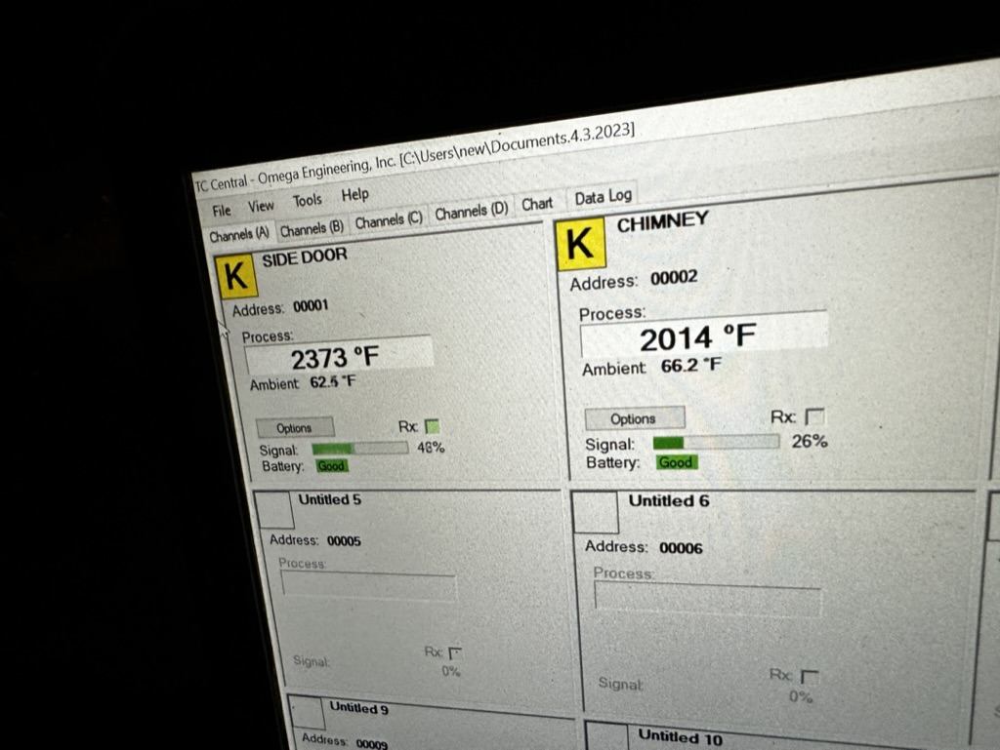

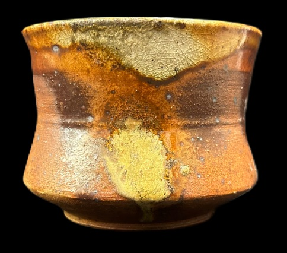

# Closing

After unloading the kiln, I found that only 1 out of 2 pots had survived. The one in front of the firebox had been smashed. This was a failure, but a good one as it gave me the opportunity to create something that could protect my pots even when placed in front of the firebox, allowing me to have both an ash surface and a clean surface on one pot. The other pot, which was placed in the middle space, had a slight effect from the slit, but it was not very noticeable. I hope to place the next pot near the firebox, but with a stronger container.

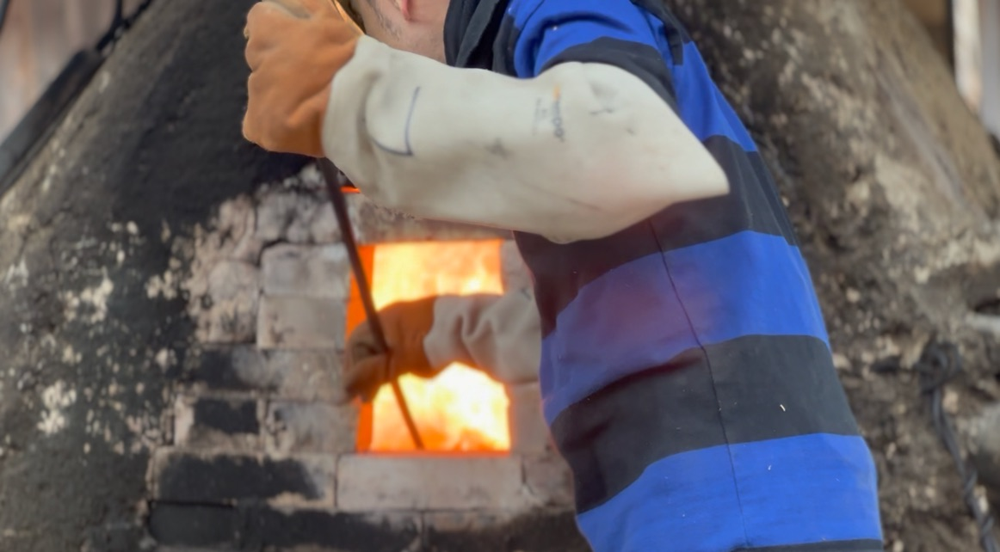

As for the firing process, I spent the entire Friday, which was actually exhausting. I arrived at 8 am in the morning and stayed until 11 pm. Overworking is not good, especially for safety reasons. I couldn't participate in the unloading process, but I was surprised to see that the firebox area looked very aggressive. Both of Trevor's large globes on the left and right were opened up, but one of the opened-up pieces was my favorite for some reason. Photo credits: @[docknitty](https://www.instagram.com/docknitty/).

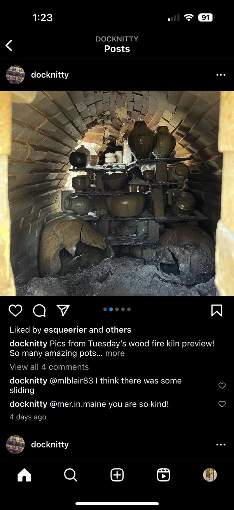

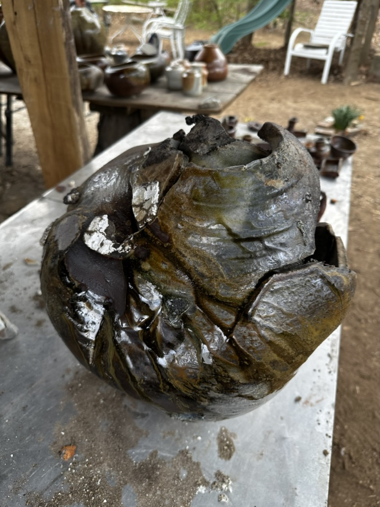

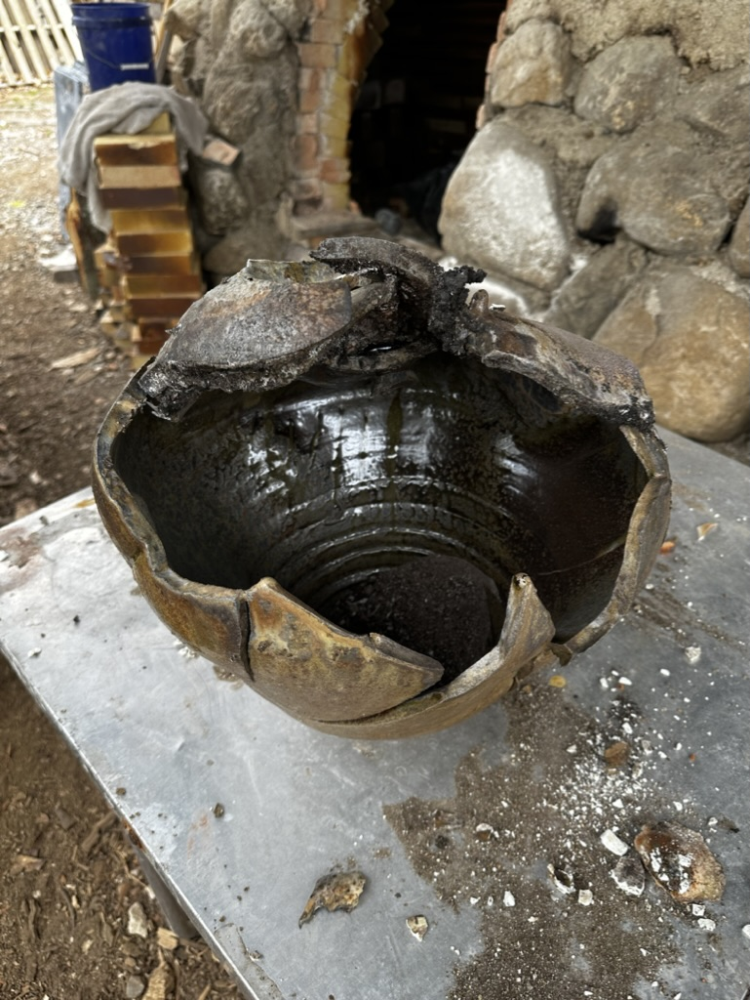

# SNS

https://www.instagram.com/p/Crw57zqry8V/

https://www.instagram.com/p/CrlF4yQgquk/

https://www.instagram.com/p/Crdn9YtAucr/

https://www.instagram.com/p/CrSDunKg6Yq/

https://www.instagram.com/p/CrLMyOygKIp/

https://www.instagram.com/p/Cqv5v1FAo0F/