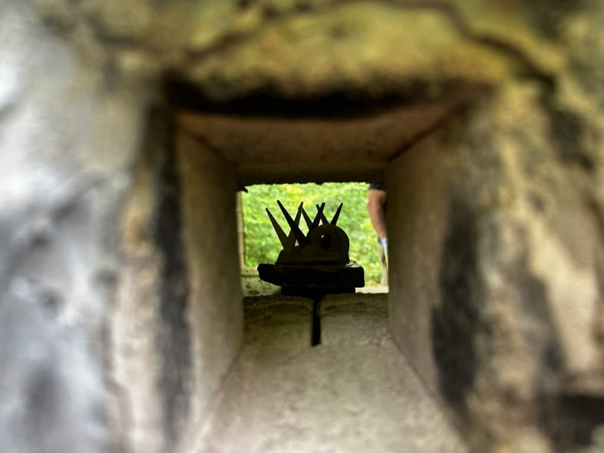
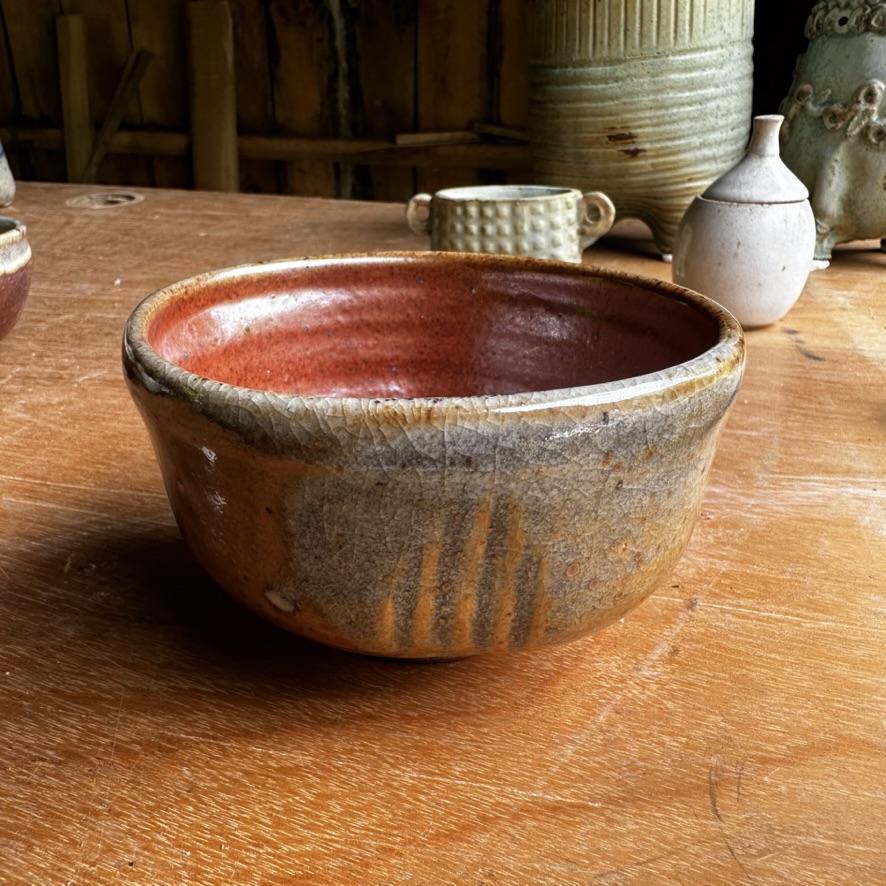
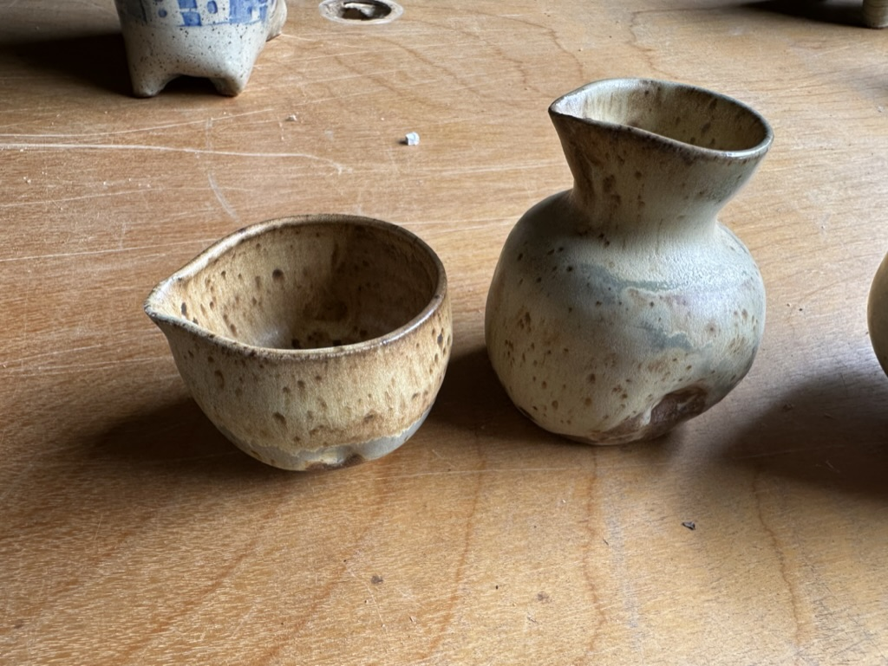
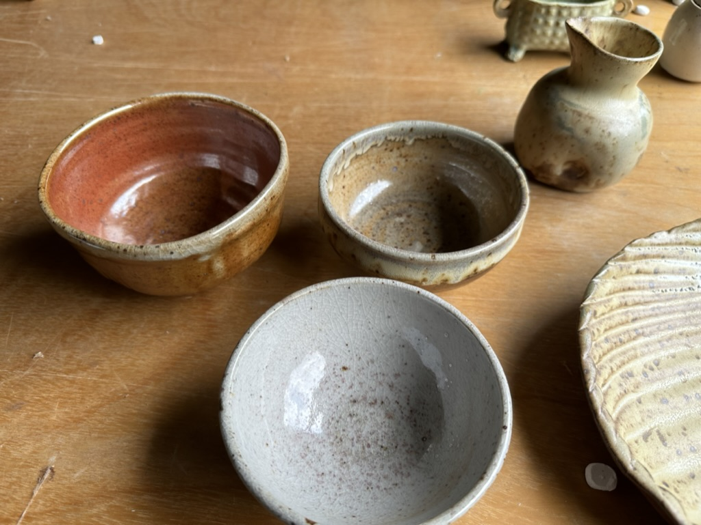
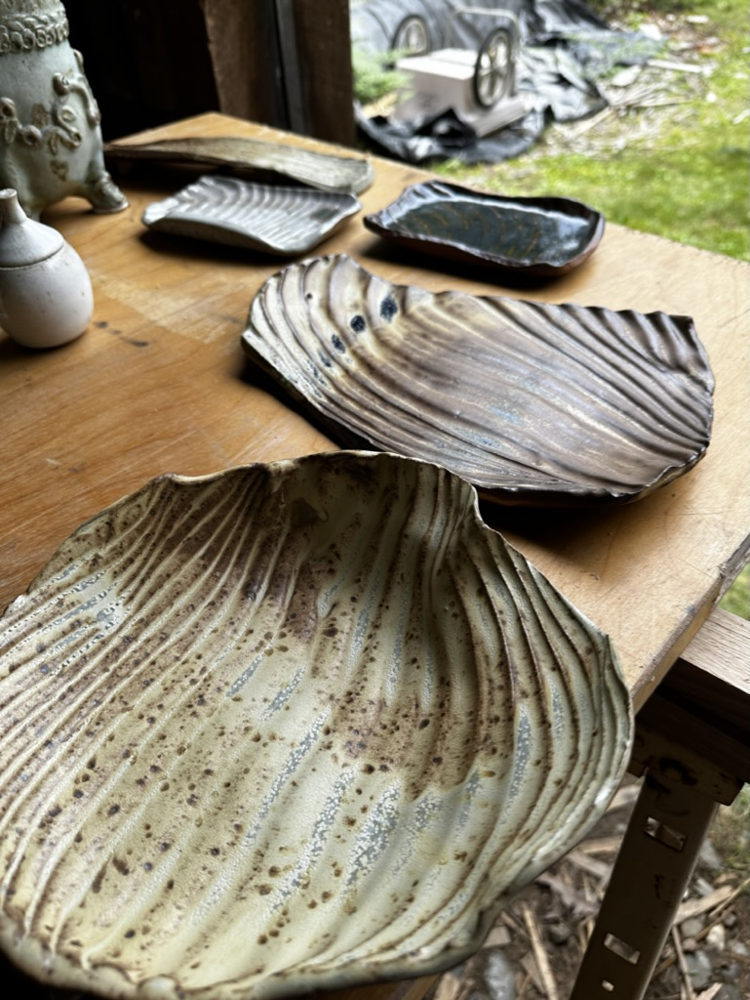
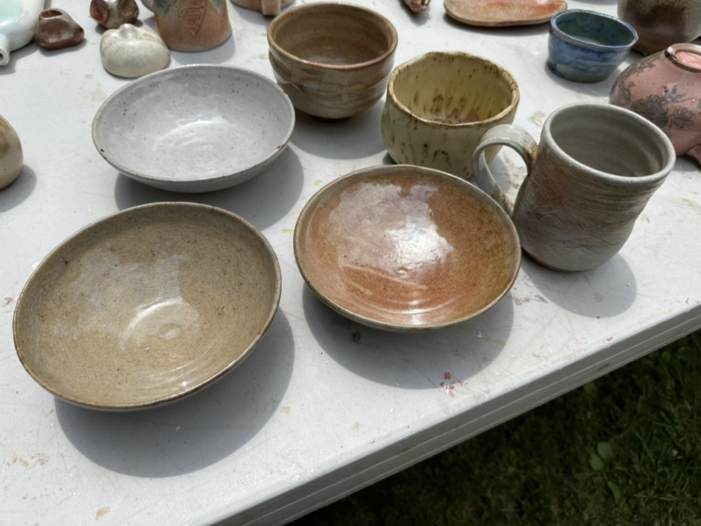
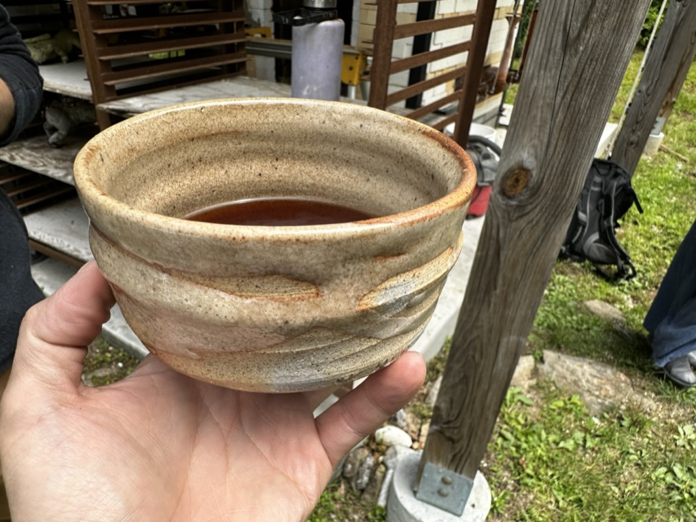

# Firing at Alison Palmer Studio

- Date: 2023-06-22
- Tags: #pottery #blog #newfc

I booked [Alison Palmer Studio](https://alisonpalmerstudio.com/) for my selected spot for the [New England Wood firing](https://www.newenglandwfc.com/) ticket. This conference gather different types of Wood Firing Kilns around east coast. This event brings together a variety of wood firing kilns from across the East Coast. I picked Alison's studio specifically because I wanted to experience something completely different from what I'm used to. The design of her kiln is unique—it features a vertically stretched catenary arch with four stoke holes located underneath. The wood used is thin and long, making for a quick firing process that wraps up within 36 hours. I took on the responsibility of loading and unloading the kiln shelves, and everyone was super helpful in showing me the ropes. Overall, I'm thrilled to have had this chance to learn and grow at the conference—after all, that's what it's all about, isn't it?

Since Alison's kiln completes its firing process in just about a day, it's particularly well-suited for glazed works. I chose to fire some of my own glazed pieces, including those with Yellow Salt, Shino, and a few other copper glazes. I also picked up some useful tips and tricks during my time there, which I'd like to share:

- Always wash your hands before loading the kiln. Touching Kaolin can leave marks on the pottery.
- For body reduction at cone 010, Alison places a ring on the cone pack, making it easier to pull out and check the 2nd and 3rd cone packs.
- Speaking of the 2nd and 3rd cone packs, place them in opposite directions for easier readability.
- I brought my own portable cushion for added comfort on my lower back.

I brought bowls, tokkuri, and teabowl.

https://www.instagram.com/p/CuFWXQYAD5w/

https://www.instagram.com/p/CuSCo7mr34M/