# Presenting at NEWFC 2023

- Date: 2023-07-01
- Tags: #pottery #blog #newfc 

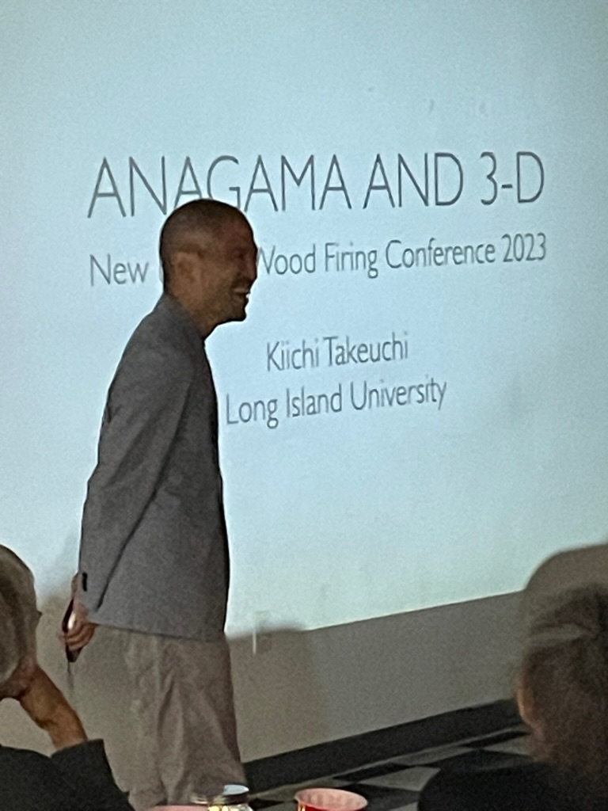

In June 2023, I joined the New England Wood Firing Conference as a presenter. Trevor, who built an Anagama kiln, was looking for a speaker for the conference he was hosting. He shared his idea about how we should come together to exchange knowledge and experiences in the format of a conference. I love to share anything I can, but as a beginner, what could I talk about? When I looked at the presenter's list, I realized that, even though the conference was titled 'New England,' we were somewhat outliers (in a good sense) in the region. There was Loren, who does solo firing at her location, Jess - a wood fire potter who travels the world, and Lillann, who fires the biggest Anagama in the Northern Hemisphere in Norway!

Trevor once jokingly called me a 'Techno-Potter' from Japan, but I decided to pitch topics about what I do at his kiln yard.

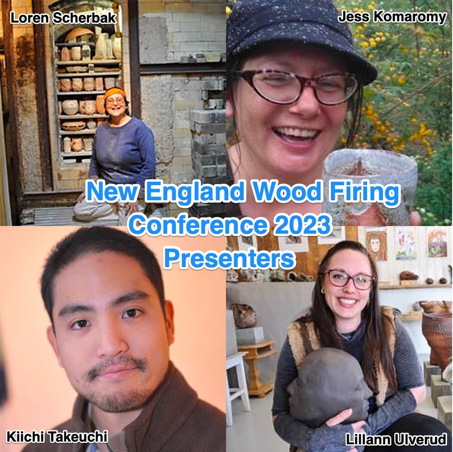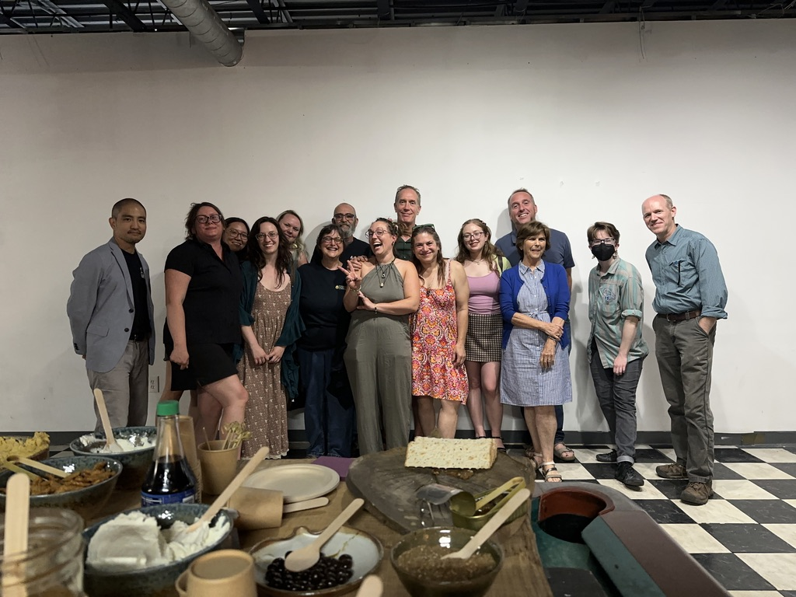

I realized my role was to add a unique twist and soften up the talk session a bit. Bringing in some tech-related talk about wood firing might interest the audience. I connected my talk with the keyword '3-D' because my work involves 360-degree 3-D panorama video shooting, scanning Anagama kilns as 3-D models, and firing 3-D printed vessels.

At [NCECA 2023](../2023-03-17/nceca-2023.md), I shared ideas on how to utilize 3-D printers in the classroom. This approach is based on the technique of scanning and printing objects. My next step was to print directly from data. Like my previous activity, I continued with the direction of printing without delving deeply into 3-D modeling software. While one approach to 3-D printing is to design using modeling tools and print what is designed digitally, I was not interested in this method. But what about printing something abstract, like numeric data?

I must confess, visualizing numeric data as graphs or charts is my specialty in the IT department at our university, so I naturally came up with the idea of printing vessels from data. If you're interested in more details, please come to my NCECA 2024 presentation on March 22, Friday!

As part of the wood firing crew, I had access to temperature data configured by [Mike](https://instagram.com/wetclayworks/). My first challenge was to visualize this data not just on a 2-D graph but also as a 3-D interactive graph. I started by mapping the temperature data sideways, creating a dish that resembles the temperature trend. In the first 5 days, it increased from 0 to 2350 F and then gradually decreased after the kiln was shut down. I thought it would be fun to build an Oribe-style dish (called Mukouzuke in Japanese) based on this concept.

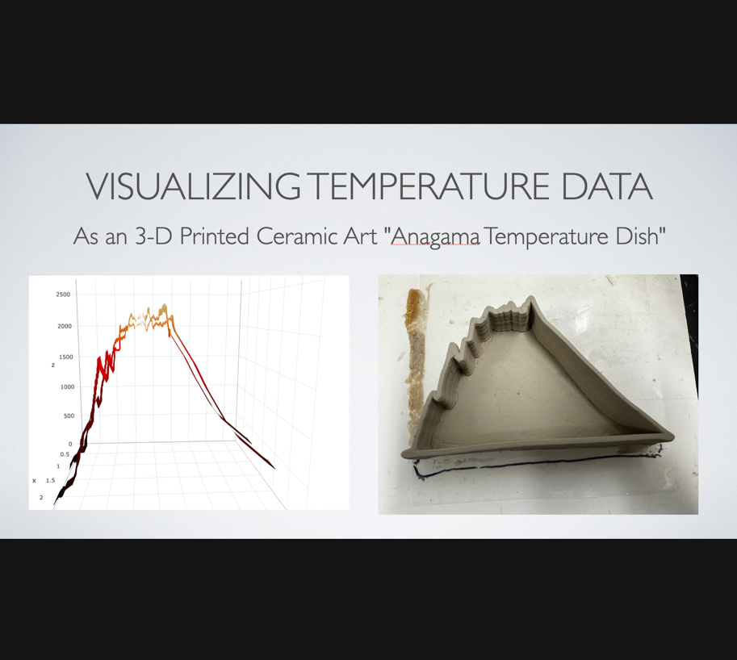
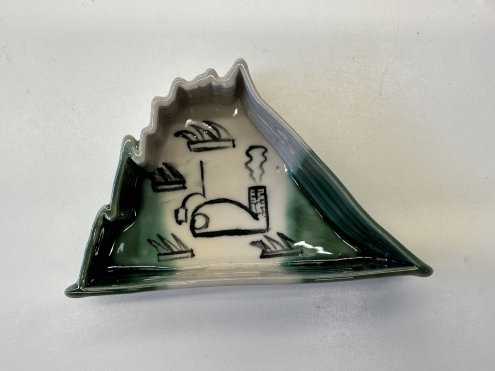

My next goal is to use a spiral method that takes the same data and raises the form vertically from bottom to top. Imagine standing the dish on its side; you would see where the temperature increase creates a concave shape and the top half forms a convex curve. Instead of simply drawing lines to stack them, I plan to draw them in a spinning motion. The diameter's size will represent the value at that moment. Below, you can see the printing process. I flipped the form at the end and then carefully attached the bottom.

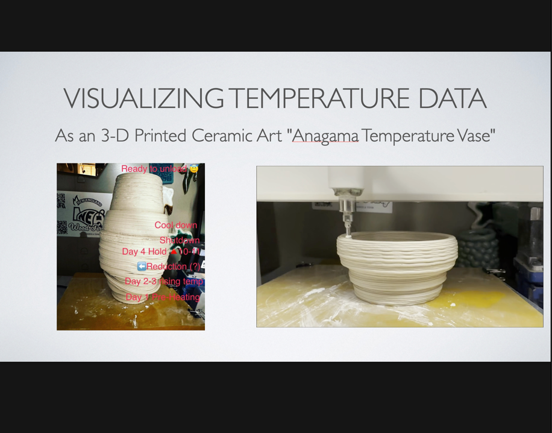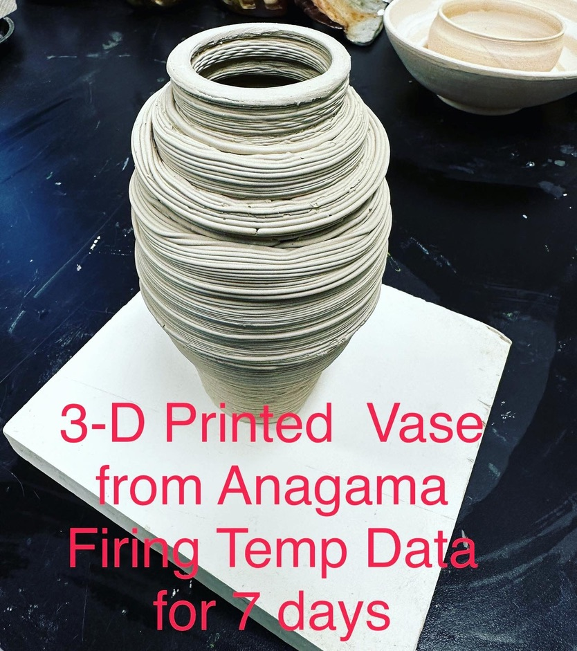

I also liked the dynamic undulation of the first half, so I decided to keep another version as a whiskey cup.

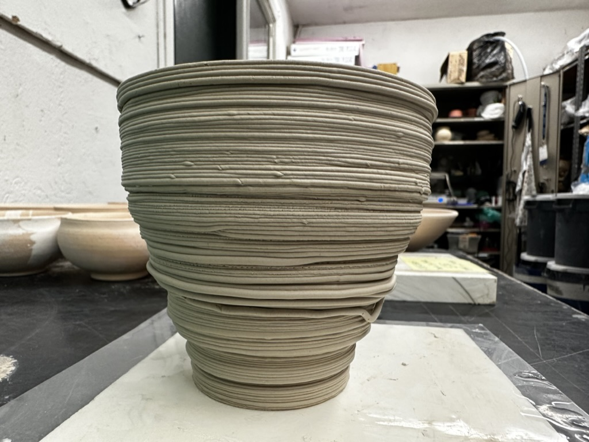
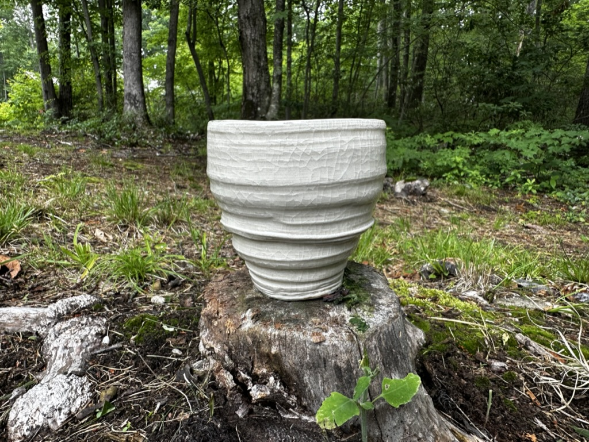

These were the topics in my presentation. I thought this conference was a great place to present my ideas, which really connect with what 'we' do in the community. I'm closing this article with a few more photos from the conference. There were lots of activities - firing (of course), music, a farm dinner, and an exhibition.

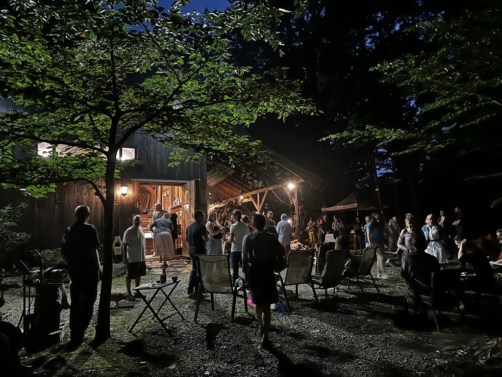
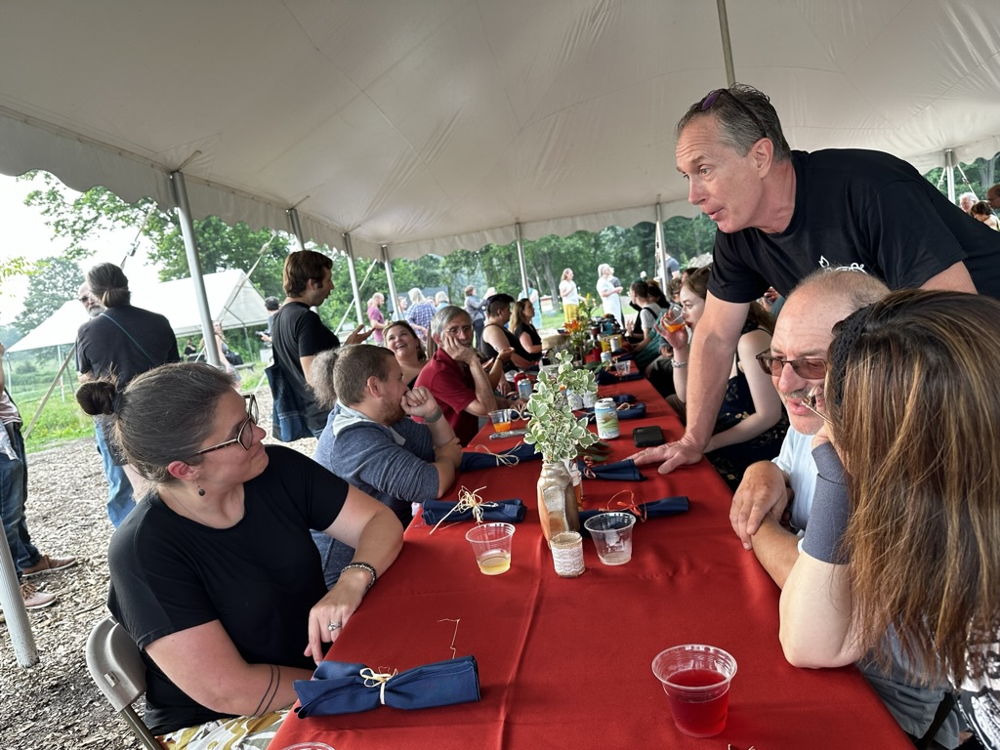
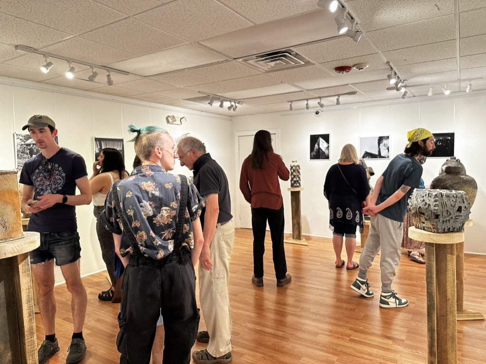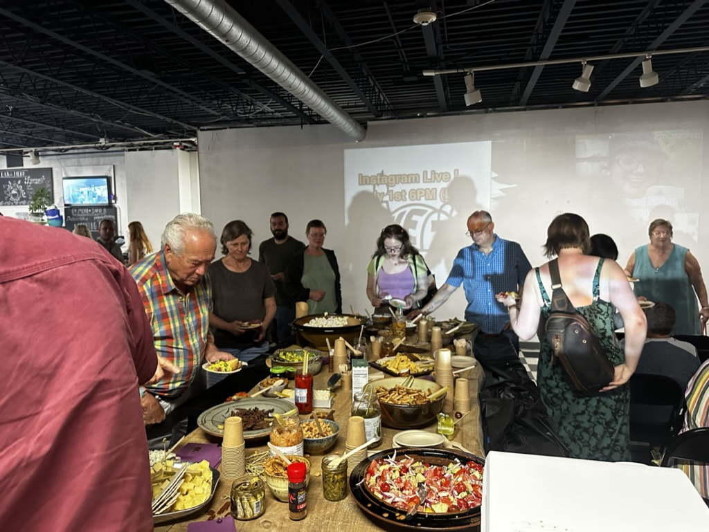