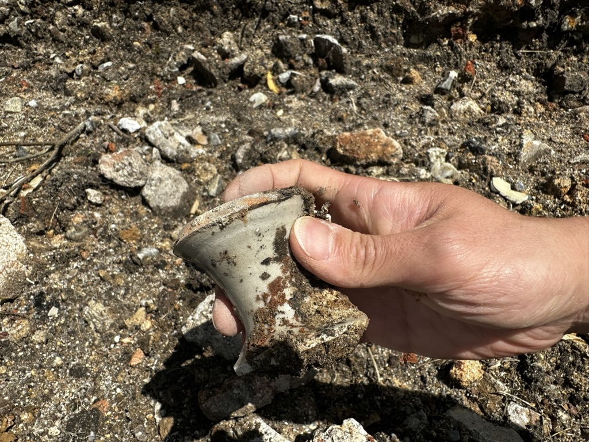

# Mingei, and so on

- Date: 2023-08-26
- Tags: #pottery #blog #mingei

The reason I became so interested in this field is because I noticed intercultural stories between east and west after world war era, which draws to the Mingei movement.

In the fall of 2021, I casually started learning pottery, introduced to it by my art-major wife through a class at LIU Brooklyn campus of Long Island University. I continued my studies in a private studio during the subsequent winter break, around the beginning of 2022. One day, my instructor suddenly exclaimed, "This is Minnesota Style!" during her demo. She had made the rim of the bowl thicker and added a few curved lines for easier handling. The point she made was to make the tumbler functional; stronger rim and unti-slip lines on the side.

Students grasped the concept of a balance between functional ware and aesthetic beauty, but why Minnesota? No one else picked up on this during the session. I researched it at home and found that it was a reference to "Minnesota" by Warren MacKenzie. Her words stayed with me, and I read stories about Bernard Leach and explored the Mingei movement by Hamada, Yanagi, and Kawai. I read more about Rosanjin, who argued against Mingei; however they all studied from Korea and China.

When I searched the keyword "Anagama," I surprisingly found more information originating from America in the domain of American Style Pottery. I discovered a retired instructor at our university who knew wood-fire potters, and I started last June at Trevor's place in Connecticut. People around me got the impression that what I do is "traditional pottery in an ancient Japanese wood-firing method because that's his heritage"—partially true since I was born in Japan, but I disagree with being seen in that light. I've spent half of my life in this country, and I came to the U.S. to study computer science. I don't have that many traditions in my background.

I chose Anagama Firing as a contemporary art process, and it has flourished among American potters thanks to efforts. We chose Anagama as a tool because no other methods can achieve what it does. I often ask myself, "Why am I doing this?" I'm fascinated by this medium as it allows me to develop notions in ceramic art. Clay is unique because it lasts for a few thousands years after firing. You can see it, touch it, and even lick it. There are no other art forms that offer this tactile experience. Unlike the Mona Lisa, which you wouldn't want to lick, we appreciate drinking mugi-cha from Hamada's yunomi.

However, the challenging part is drawing the line in mass production or unique art object due to the impact of industrialization. Anagama is a lost technology; the Japanese haven't used it for 400 years since the arrival of Nobori-Gama technology from Korea in the late 1500s. But don't get me wrong, I'm not saying "the older way is better." Indeed, soft bricks didn't exist 1000 years ago, and pyrometric cones were invented by a German engineer. We use smartphones to set alarms for our 4 a.m. shifts.

I want to study all of these aspects, whether I adopt them or not. Additionally, I need to practice a lot to gain the necessary skillset for building good forms. One of my instructors said, "Learn the basic knowledge and skillset. Then, you can do Picasso stuff." Without the basics, I can't engage in constructive debates within the community, which is why I started my BFA last year.

When I started learning, I didn't understand terms like "Carbon Trapping," "Reduction Cooling," or "Flashing," but now I do. I try to have an independent view on my results to avoid pitfalls like thinking "more carbon trapping on the rim is better." However, I won't give up on reproducing what I like using the techniques I've learned. This spring, I met a potter, Shinohara, in Shigaraki. He told me a story about chocolate from a physics professor who visited his work. The professor explained that chocolate is designed to melt at body temperature, but understanding the mechanism is different from experiencing its deliciousness. When I met Jack Troy, his words have added  another dimension to this story in my thought process. He mentioned critiquing right after unloading kiln is the worst time because some aesthetic values require some time to understand. I guess I have to mature to appreciate bitter chocolate.

After jotting these thoughts down, my mind ironically circled back to the earlier discussion about chocolate. Am I still analytical about all techniques in ceramic art? probably yes, but am I enjoying the sweetness of the art? That's questionable at this point. Pursuing art in 2023 feels peculiar. People often advise, "Find your own voice," "Be unique," or "Artists should be crazy." However, these sentiments also constrain artists, as they deter us from adopting styles of previous artists.

Returning to my thoughts on Mingei and contemporary art—I'm hesitant to describe Mingei simply as folk art. I see it as Yanagi's counter argument to modern individualism in art. Meanwhile, when I watched a documentary featuring Kevin Crowe who is a famous wood-fire potter in VA, I noticed he stamped his maker's mark on the side of his pieces so that people can identify that's his work. He was commenting that like joke but I think it captured something inside of my mind. So, I did the same. It's a little egotistical to flaunt ,[my less-than-perfect maker's mark](../2023-01-02/about-ugly-makers-mark.md) but I suppose we'll never return to being anonymous potters. Nonetheless, I believe we can still carve out our individual ethos in our work.