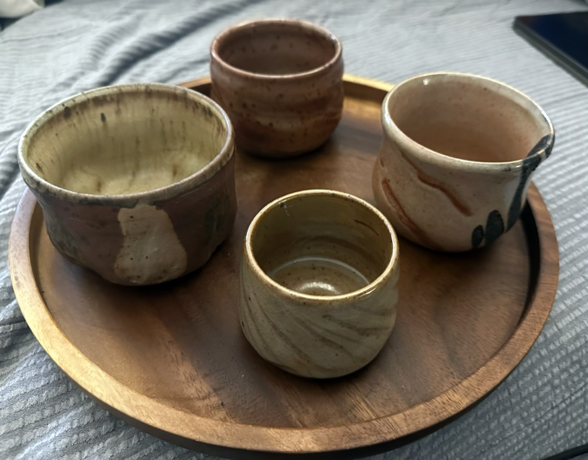
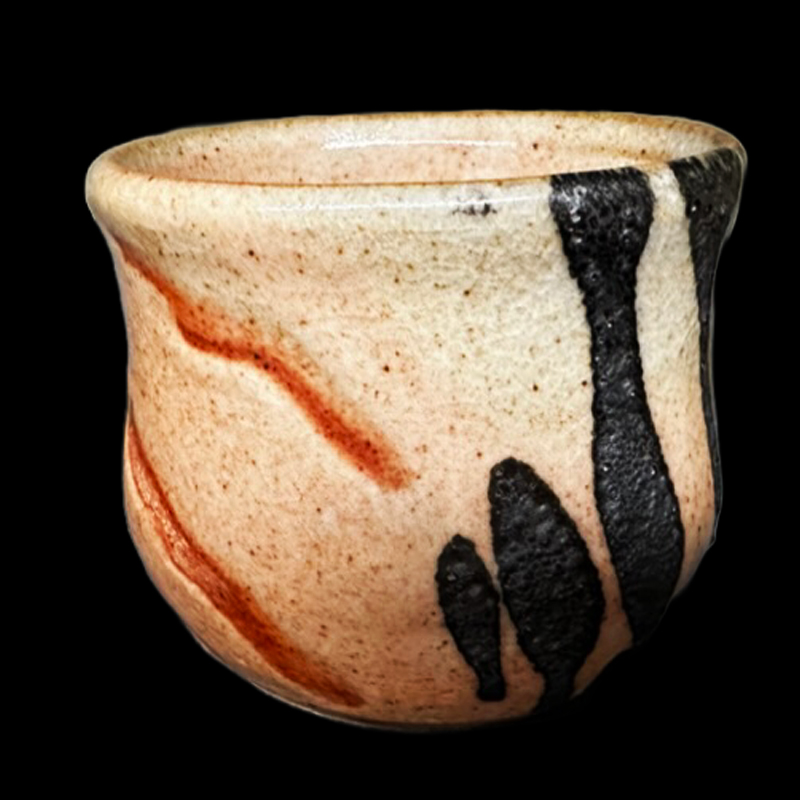
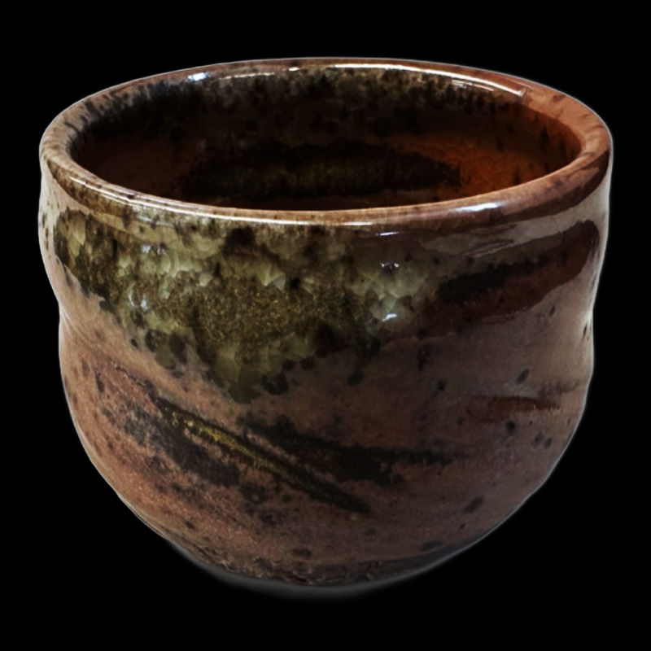

# Notes for Vince

- Date: 2023-05-29
- Tags: #web #blog  #unlisted 

This is my notes in case if you need to explain something about those. I curated them in chronological order so that you can see my progress in different forms. I don't know how to name those so I guess you can give name to them. If you came up with good ones, please let me know.

# Small White Whiskey Cup with Stipe

[whiskey-cup-white-stripe-1](../../../works/2022/cups/whiskey-cup-white-stripe-1/whiskey-cup-white-stripe-1.md)

I created this piece in early 2022, and I really enjoy the surface decoration style with the curved lines. The use of Shino glaze resulted in beautiful crackle patterns on the stripes. My intention was to design a whiskey cup that would enhance the flavor, which is why I incorporated the extra angle into the shape.

# Salmon Pink Cup with Craw Marks

[whiskey-cup-craw-1](../../../works/2022/cups/whiskey-cup-craw-1/whiskey-cup-craw-1.md)

This piece was created towards the end of 2022. It was fired in our gas kiln, which unfortunately we lost when our University decided to tear down the craft center. From that point on, all my works were fired in an Anagama/Wood Firing Kiln in Connecticut. This cup represents a challenge I was facing at the time, as I was learning how to make glaze by myself. The specific type of Shino used in this cup is known as "American Shino" and was invented by John Britt at Penn State University. That's why you'll see the ***PS Shino*** mark on the back of the cup, as it was the first glaze I mixed myself. This particular Shino reacts differently depending on the shape and firing schedule. After dipping the glaze, I scratched it with my finger in order to create variations in thickness and reveal different colors. To add some accent, I decided to drip black iron oxide onto the surface. Don't worry, the iron oxide is food-safe, so it's perfectly safe to use for drinking.

# Red Whiskey Cup with Speckled Iron Dots

[whiskey-cup-red-2](../../../works/2022/cups/whiskey-cup-red-2/whiskey-cup-red-2.md)

It's fascinating to see how the Shino glaze reacted differently in the wood firing kiln. The presence of pine wood ash landing on one side created a unique landscape with stripe lines. As I was making this piece, I once again thought about creating a whiskey cup, so I added a dent in the middle for a comfortable grip when the drink is chilled.

I have another story to share about this cup. As I mentioned before, our University decided to downsize the art department, and as a result, the Wood Firing Kiln on campus was demolished. However, the university donated the bricks to the Anagama builders in Connecticut. I had the opportunity to go there and help build the kiln myself. I'm incredibly proud to have been a part of constructing the kiln, and I brought this cup along for its first firing in the newly built kiln.

# Yellow Salt Whiskey Cup

[whiskey-cup-hake-1](../../../works/2022/cups/whiskey-cup-hake-1/whiskey-cup-hake-1.md)

This piece from February 2023 showcases my ongoing exploration of creating a Whiskey Cup or Tea Bowl. I purposely chose an iron-rich clay body, which is why you can see the red clay peeking through the glaze. The iron in the clay reacts with the glaze, creating dark spots that flow downward, adding an interesting dynamic to the surface.

To achieve the shape of this piece, I scraped the bottom using a sea shell from the north shore in L.I. After shaping the form, I applied a white clay slip with a brush, creating the contrasting dents and colors that add a playful element to the design.
