# About
- Title:  Not for Tomato Soup Cup
- Date: 2022
- Place: New York
- Medium: Porcelain
- Dimensions: H 10cm x W 10cm x D 10cm
- Description: This is a functional ceramic cup which I printed using 3-D clay printer. In this artwork, I wanted to address global warming as major issue in our generation. Let me explain how I built this. The idea behind this sprial form is to visualize numerical temperature data as concrete object. Original data is is monthly mean temperature anomalies from 1880 to the present. You might notice that the line gradually increases because the temperature increased by 1.5 degree in celcious over 140 years. I wrote a program to take the spreadsheet as input, and I transformed timeseries data into gcode file, which is compatible with our 3-D clay printer. This curve directly reflects on the wall of the cup. You can think this sprial form is like tree ring.  Every layer represents each year. Printer head moves in circular motion, like January, February, March, etc... and it deposits the slip layer by layer. The diameter represents the temperature. If the temperature increased at the time, the size of ring gets bigger on the layer. If it decreased, the ring shrinks. Alghough there are some warm years or cold years, you can observe the rim inflates as it rises. After the printing process, I attached the bottom, then I took it to bisque firing. I carefully brushed underglaze so that I can emphasize the temperature changes all the way up. I also cover it with glossy clear glaze so that it would be water proof. After glaze firing, I applied the gold low-fire glaze to indicate the current era, so I fired it twice. If you are interested in more technical details and references, please checkout my repository https://github.com/kiichi
- Tags: #cup #3dprint  #year2022 #underglaze #exhibition #sold

# Images

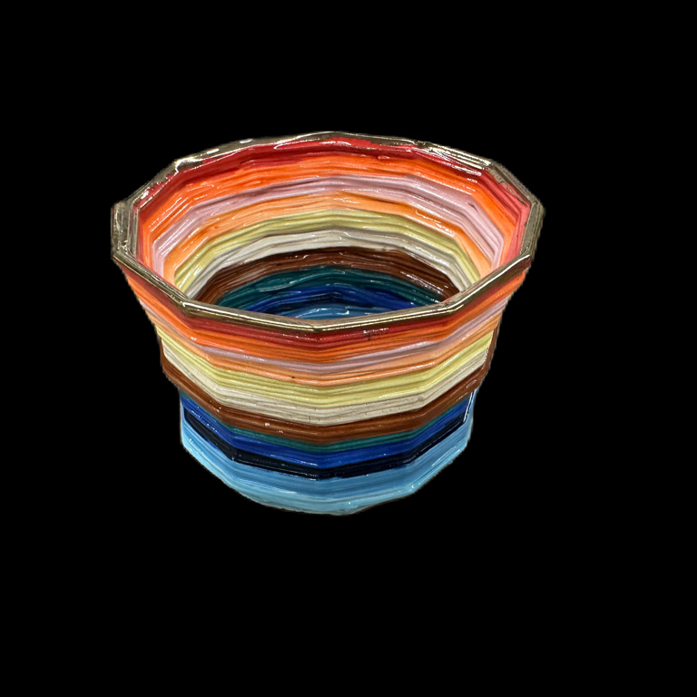
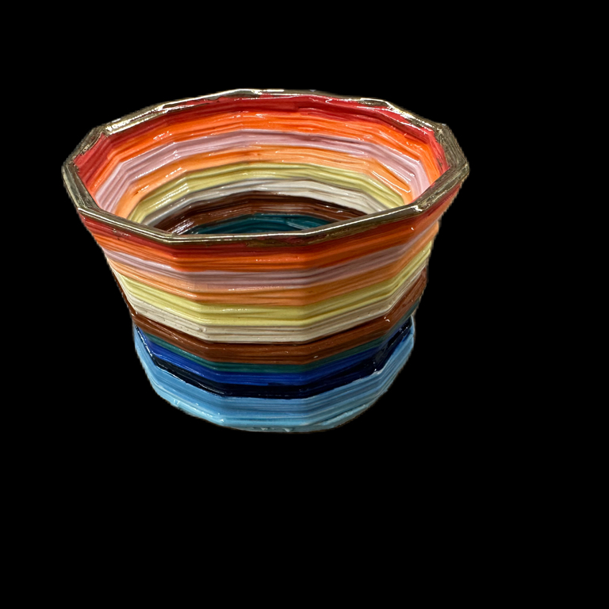
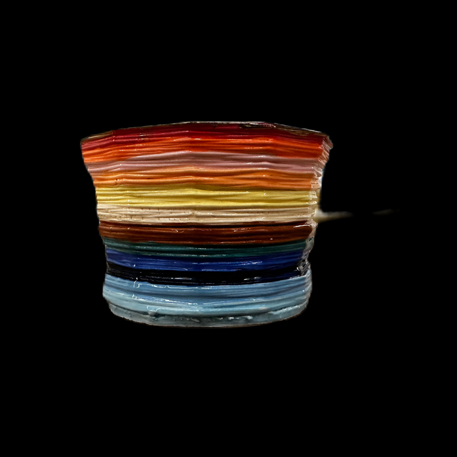
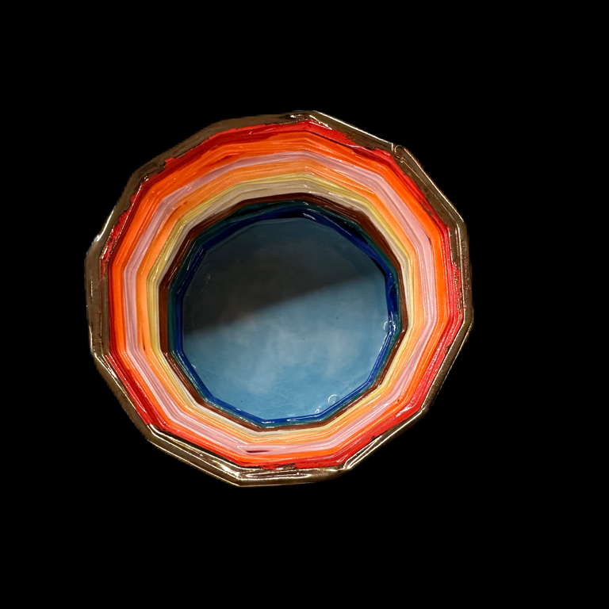
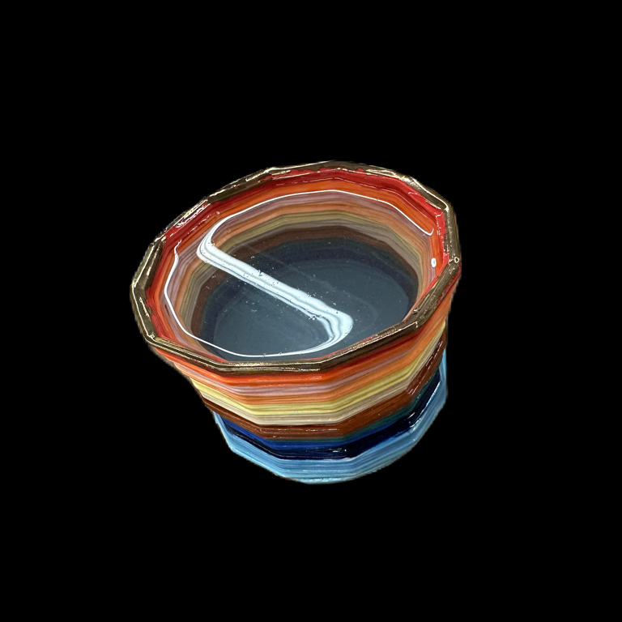
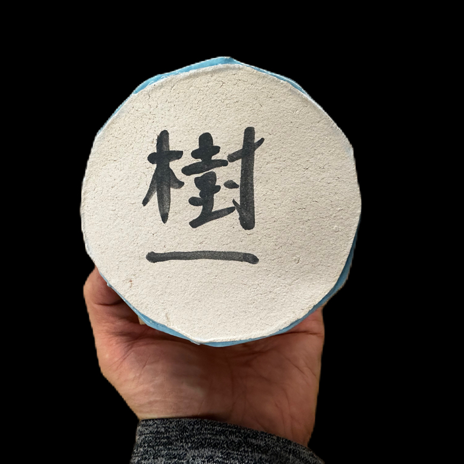

# 3-D

# More Images

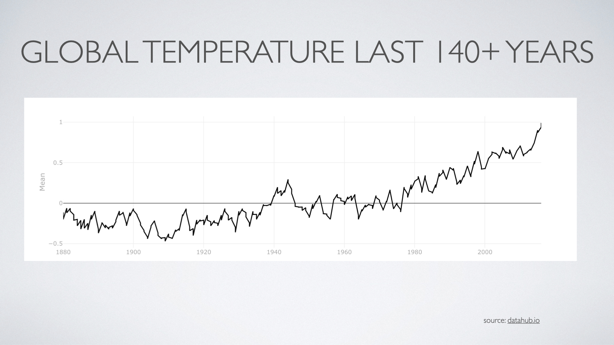

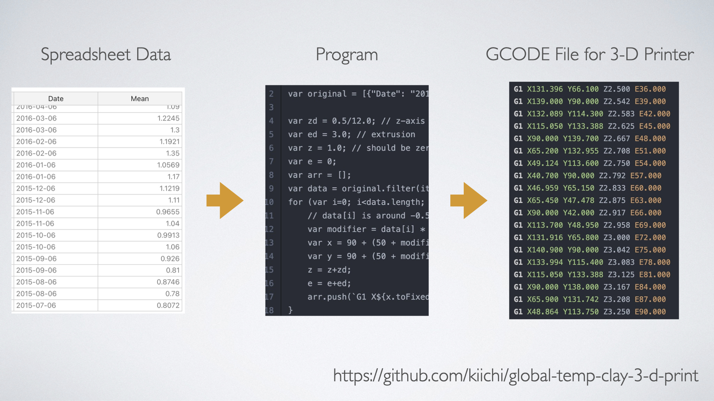

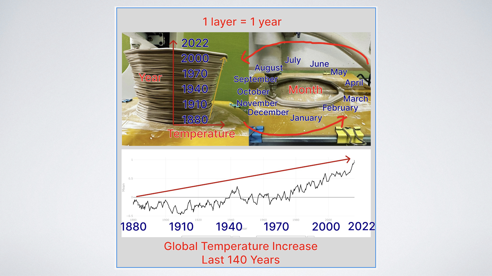

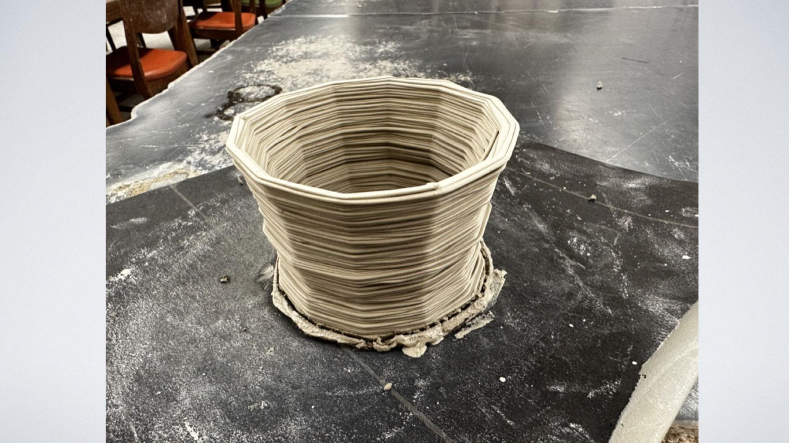

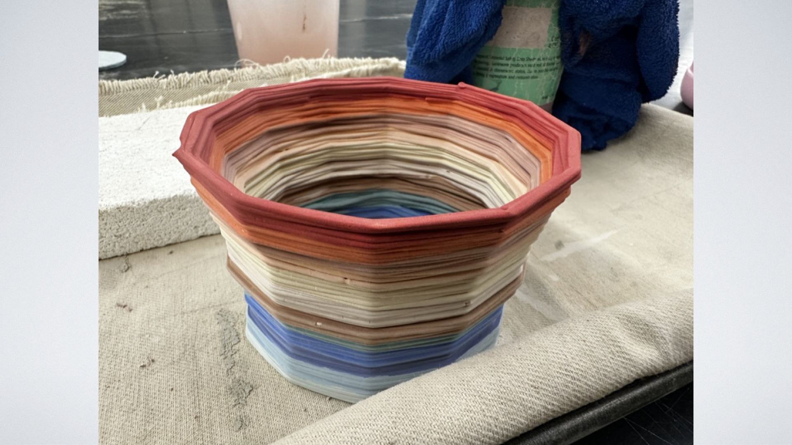

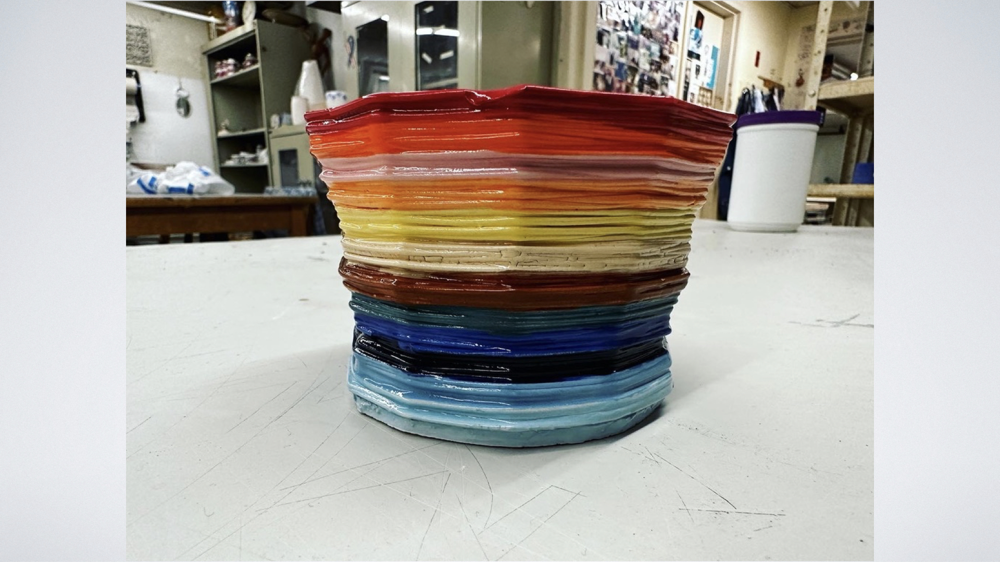

# SNS and Videos

https://youtu.be/Jrq0kxluFMQ https://www.instagram.com/p/ClzffW4gu7Z/ https://www.instagram.com/p/Ck0vLADuF_g/ https://www.instagram.com/p/Cj1DPfCOR9D/ https://www.instagram.com/p/CjzG3PRjUUl/
