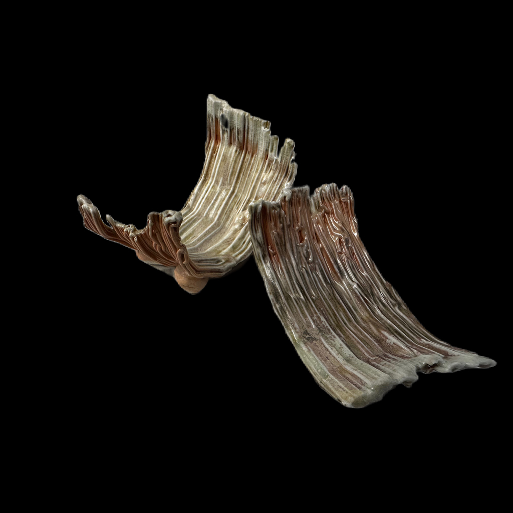
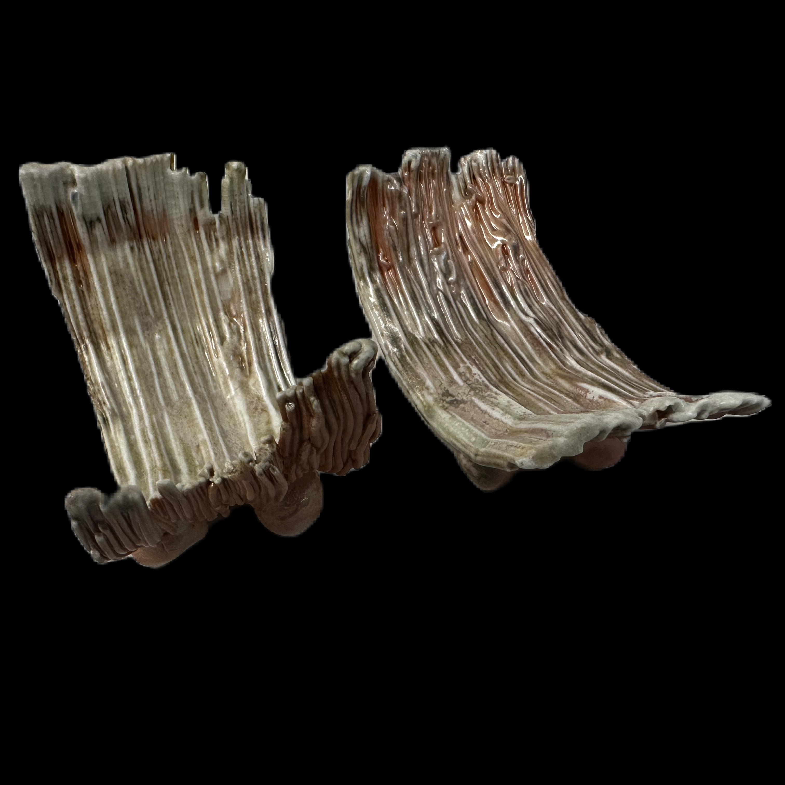
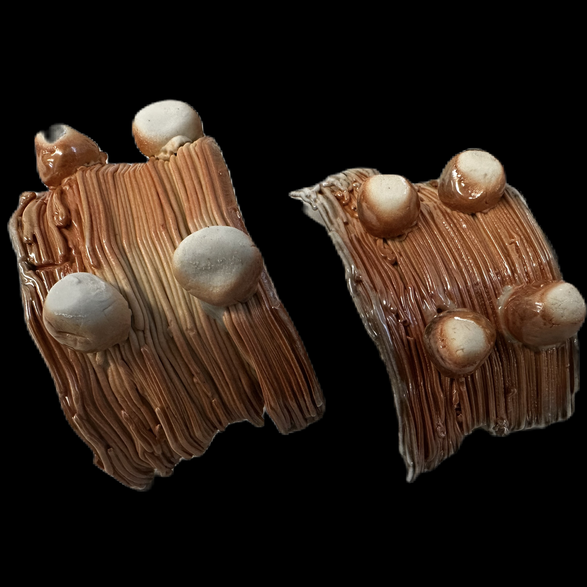
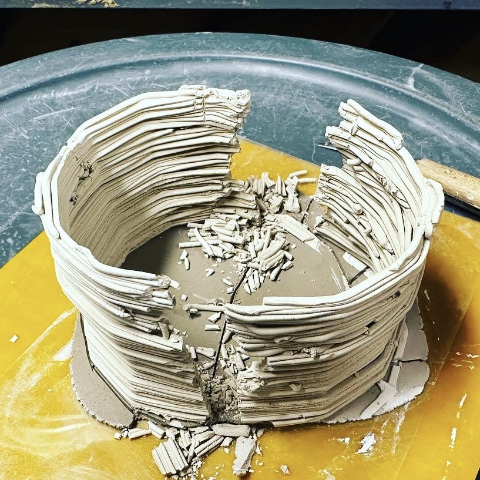
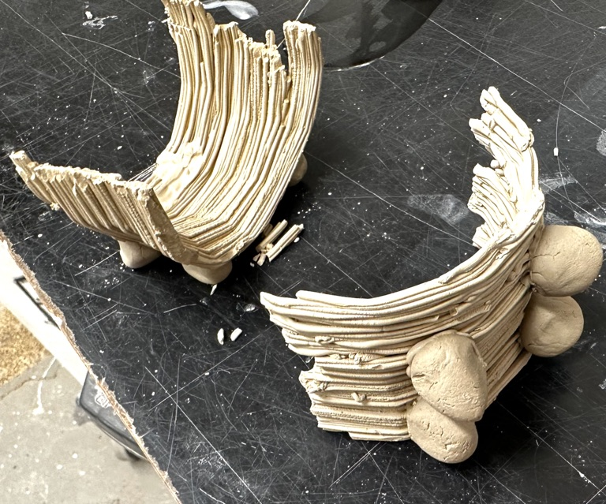

# About
- Title:  Sasara Mukou Zuke (簓向付)
- Date: 2023
- Place: New York
- Medium: Porcelain
- Dimensions: H 4cm x W 5cm x D 4cm (Each)
- Description: This is decomosed paired half dishes to hold small appetizer such as Ikura or Uni. Fired in wood kiln (Anagama). Each edge have been lightly glazed with Oribe.
- Tags: #3dprint  #white #porcelain   #year2022 #woodfiring #shino #crackle #dish
- OrdNum:0

# Images

# More Images

