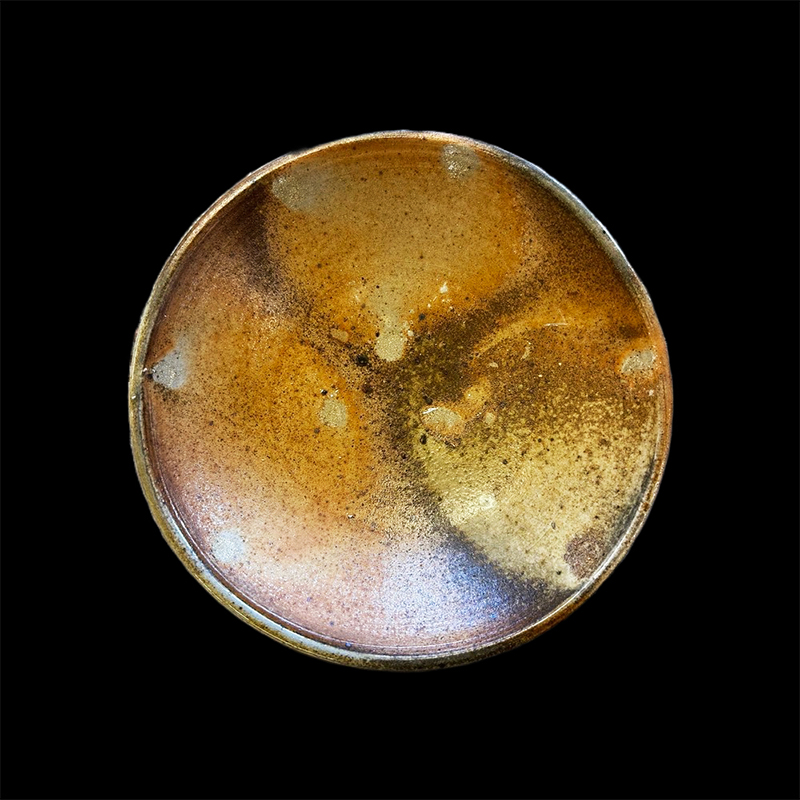
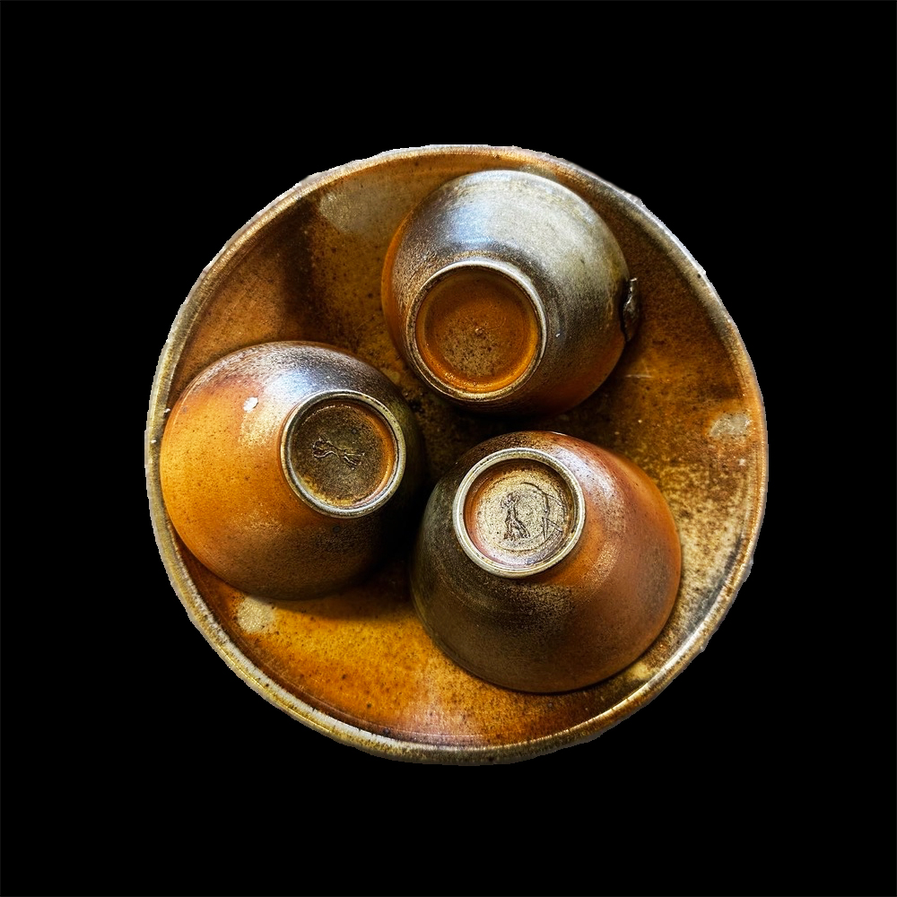
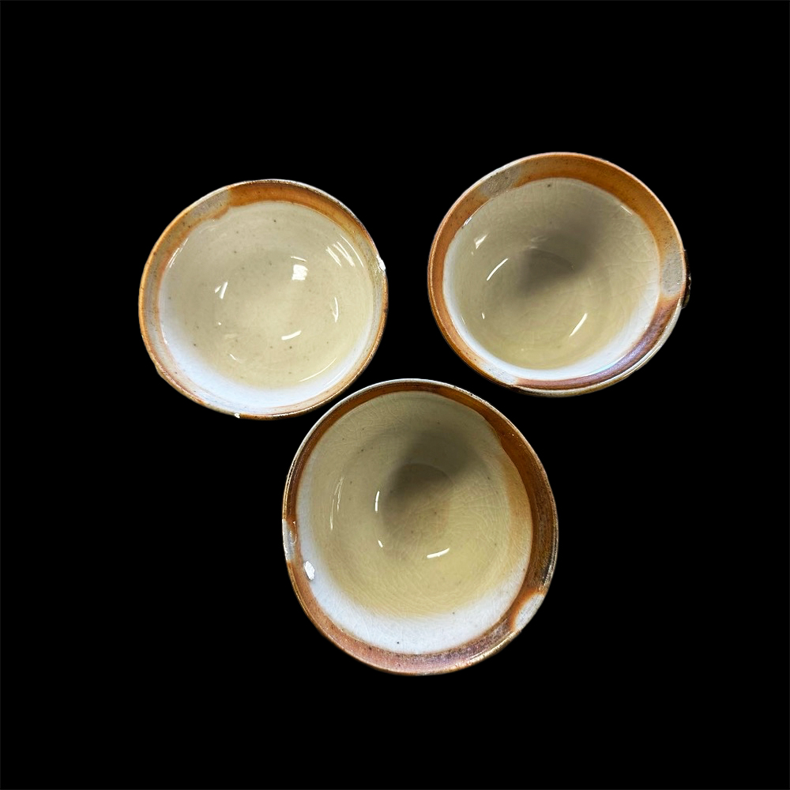
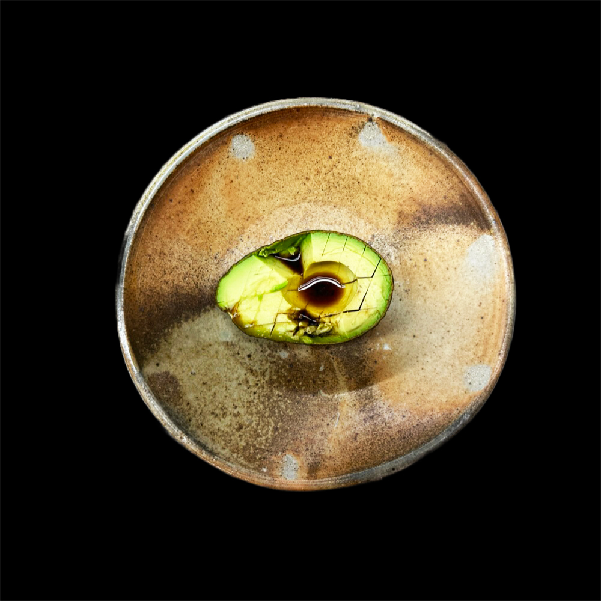
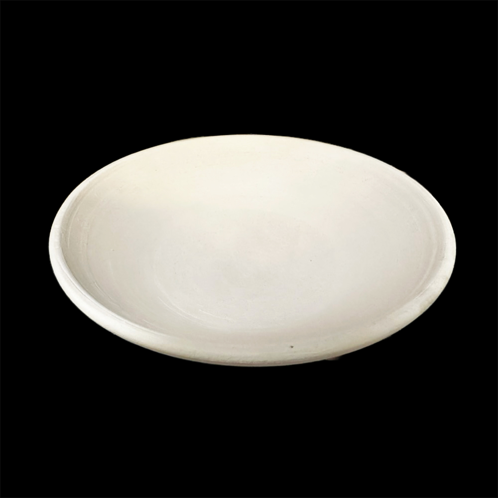
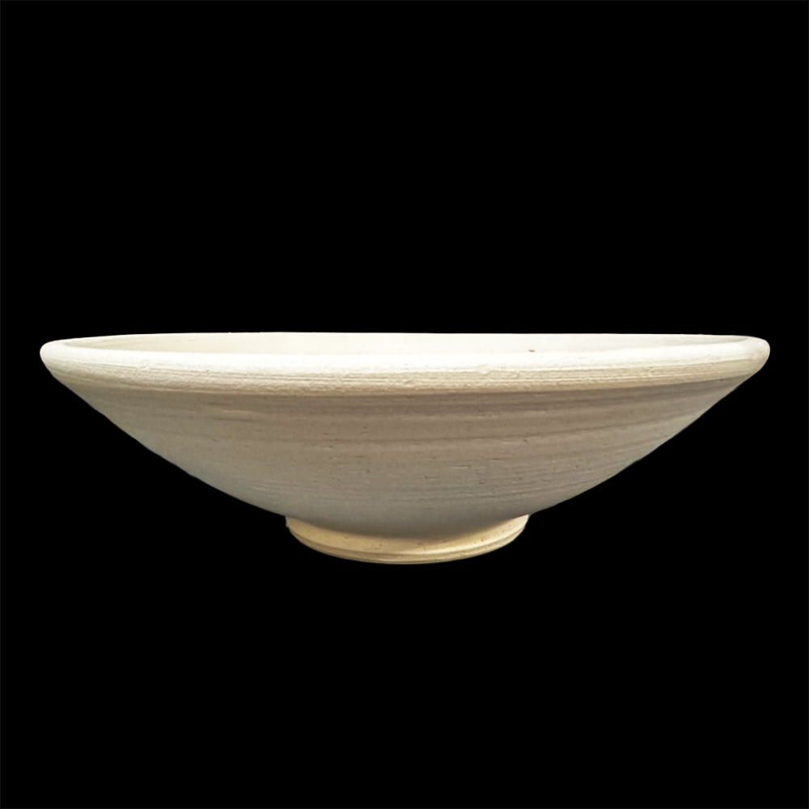
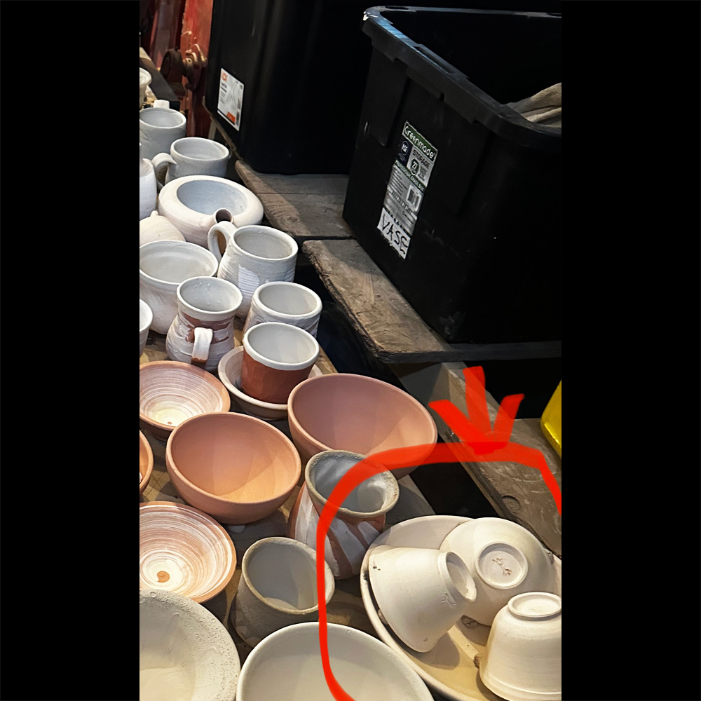

# About
- Title:  Brown Bowl with botan mochi
- Date: 2022
- Place: New York
- Medium: Stoneware
- Dimensions: H 5cm x W 20cm x D 20cm
- Description: Thrown with white stoneware body, and it was fired with 3 cups flipped in order to make fire marks "Botan Mochi". The result of this woodfiring piece was success, and the distinctive flame direction appeared along the valley of cups. Inside cups are glazed with white traditional shino.
- Tags: #bowl  #brown  #year2022 #woodfiring #shino #crackle #sandspointcollection #sold
- OrdNum: 810

# Images

 

