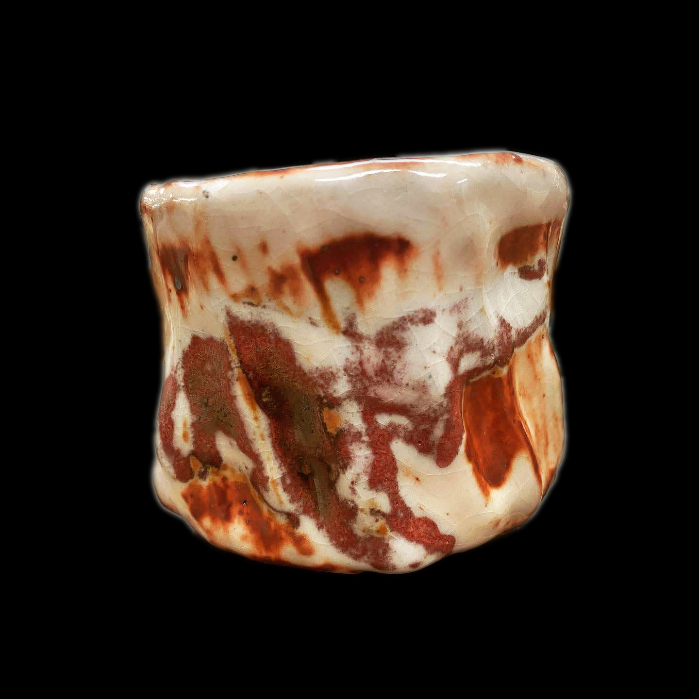
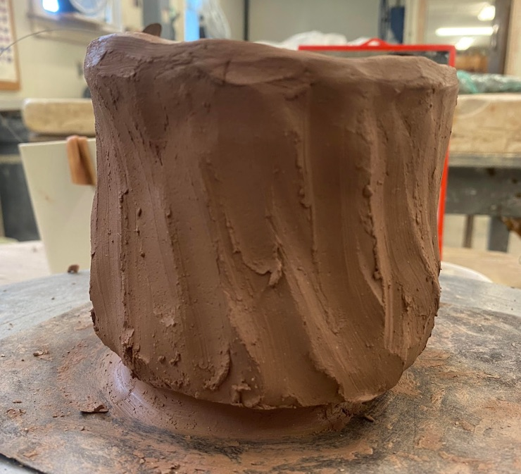

# About
- Title: Tea Bowl, Fire Red
- Date: 2022
- Place: New York
- Medium: Stoneware with Shino glaze
- Dimensions: H 10cm x W 10cm x D 10cm
- Description: This is one of my hand-build (Tedsukune) tea bowl.
- Tags: #cup #red  #year2022 #teabowl #gasfiring #carbontrap #oribe #shino #tedsukune #3d
- OrdNum:800

# Images

# 3-D

# Other Images

# References

- [人間国宝を訪ねて①鈴木 藏 陶芸/志野 | ホーム ・キッチン＆アート | 三越伊勢丹オンラインストア【公式】](https://www.mistore.jp/shopping/feature/living_art_f2/art107_l.html)