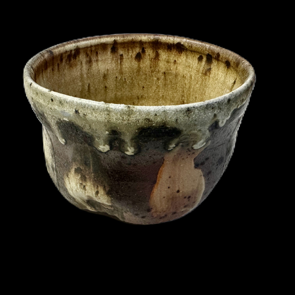
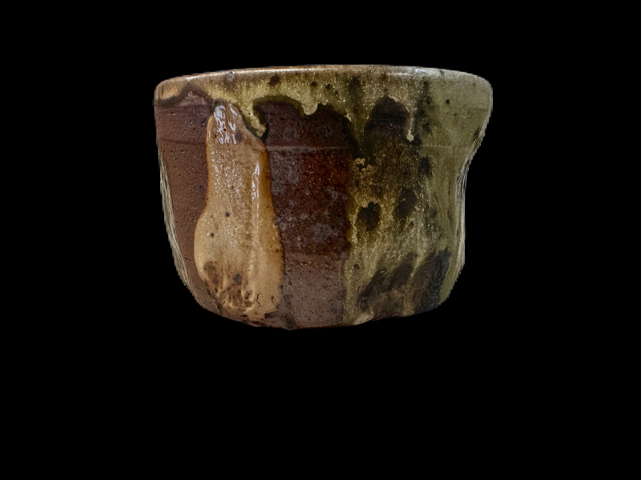
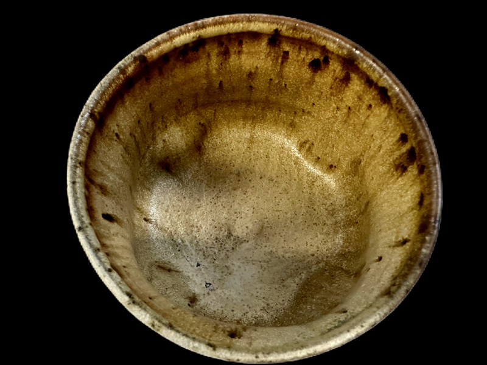
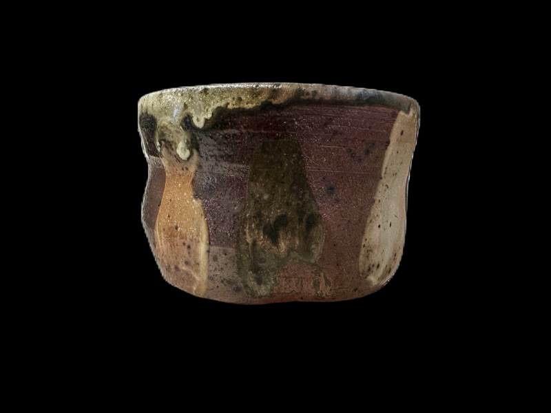
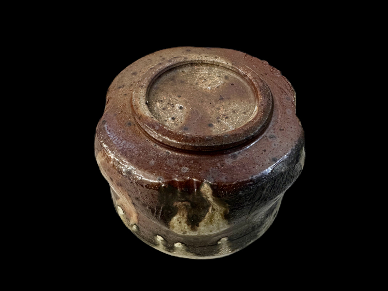

# About
- Title:  Whiskey Cup, Hake
- Date: 2023
- Place: New York
- Medium: Stoneware
- Dimensions: H 10cm x W 14cm x D 14cm
- Description: Matte surface decorated with slip and glaze by hake brush. Iron spots emerged inside cup. Natural wood ash created running glaze on the rim.
- Tags: #cup #yellowsalt  #year2023 #woodfiring #ironspot #matte #whiskey 
- OrdNum: 120

# Images

