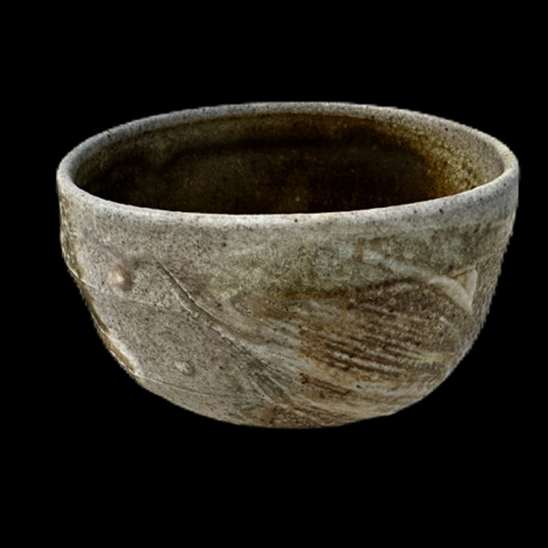
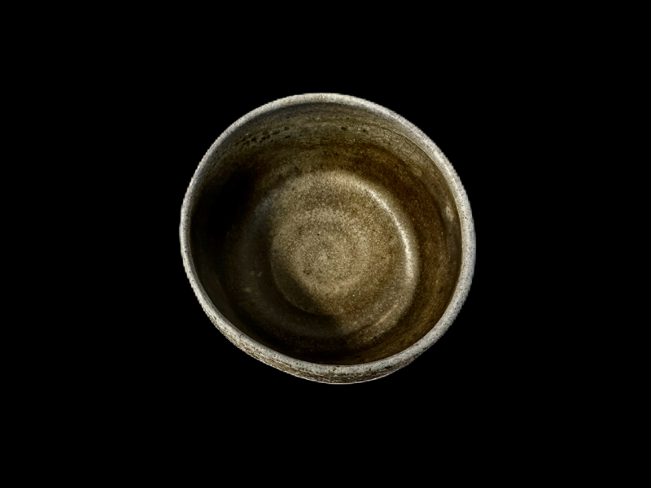
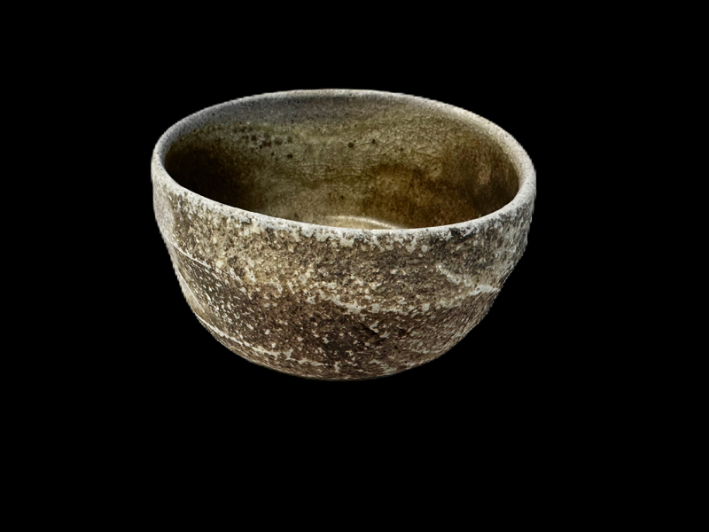
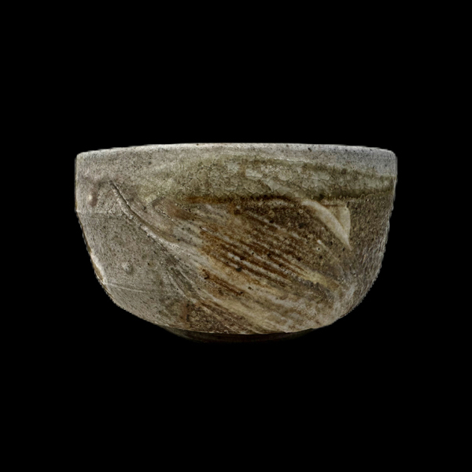
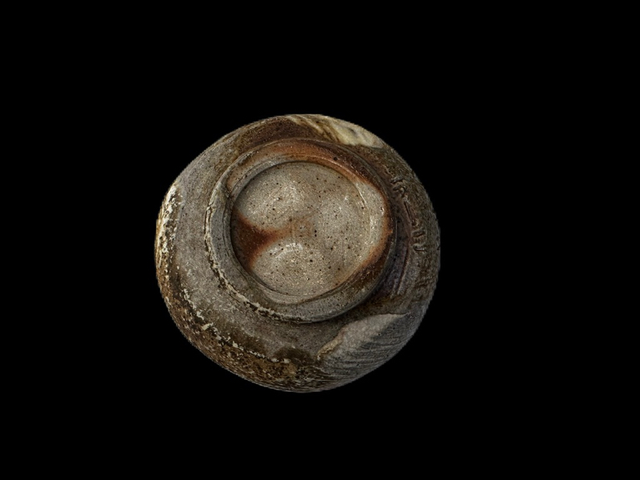
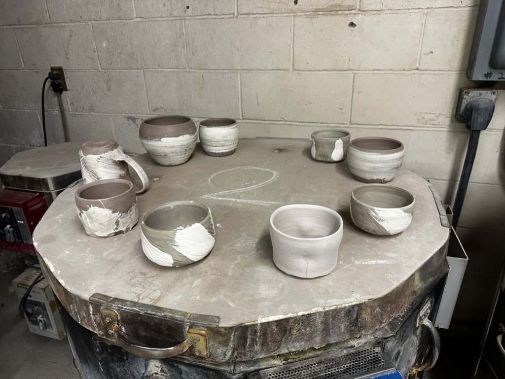
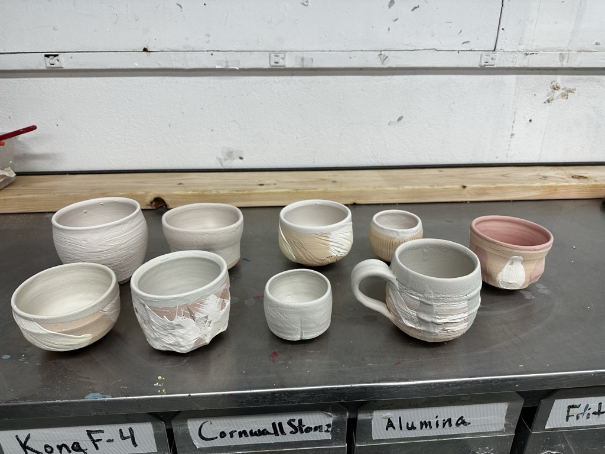
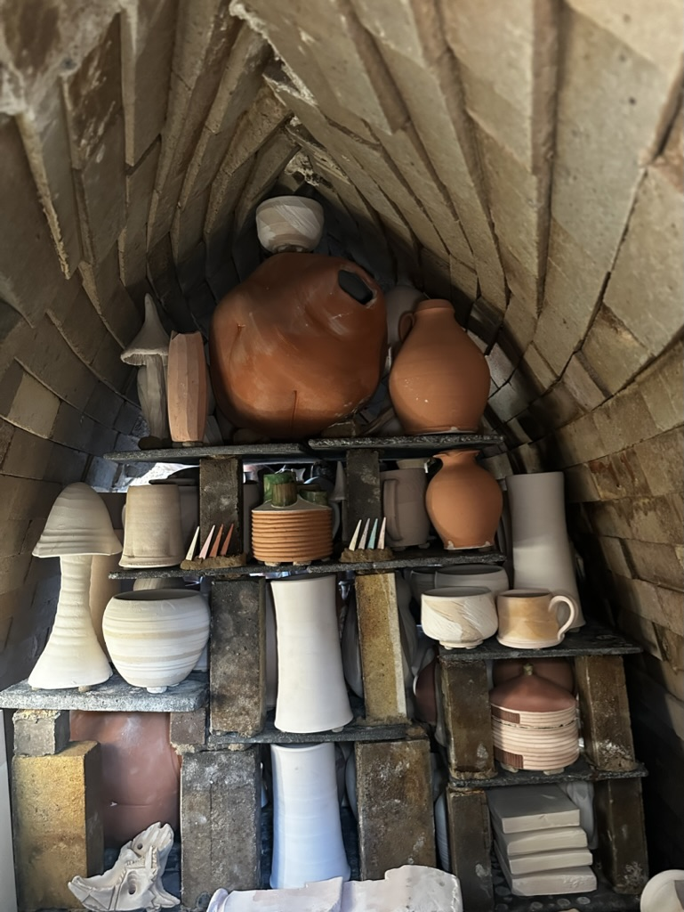

# About
- Title:  Whiskey Cup, Kezuri
- Date: 2022
- Place: New York
- Medium: Stoneware
- Dimensions: H 8cm x W 14cm x D 14cm
- Description: Fired in the highest location of anagama. Scraped surface with sea shell and slip was applied on the surface.
- Tags: #cup  #year2022 #woodfiring #shino #slip #making
- OrdNum: 100

# Images

# Making

https://youtu.be/z1pAiVRpUG4

