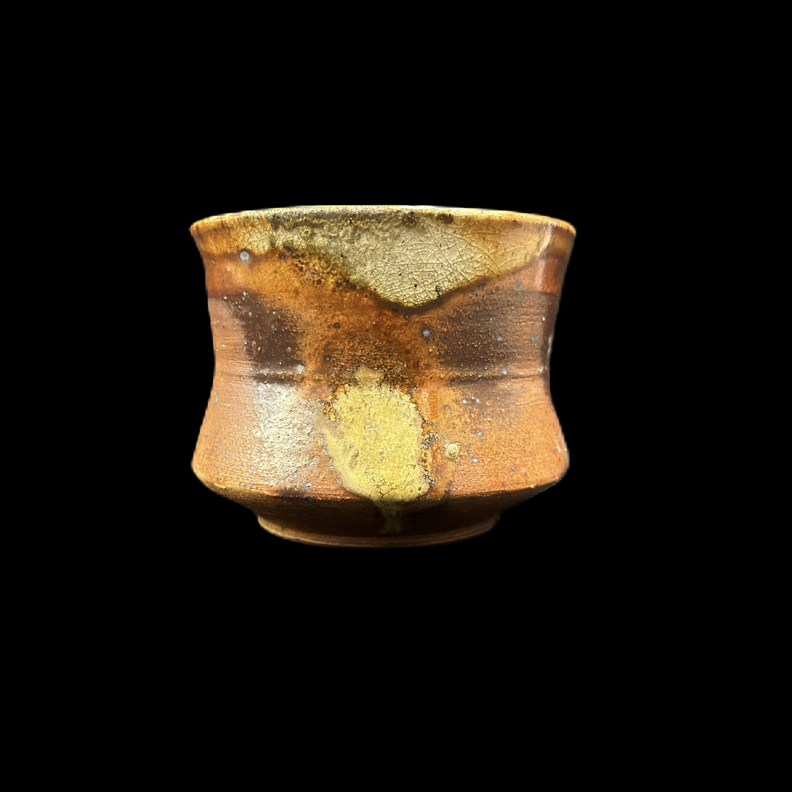
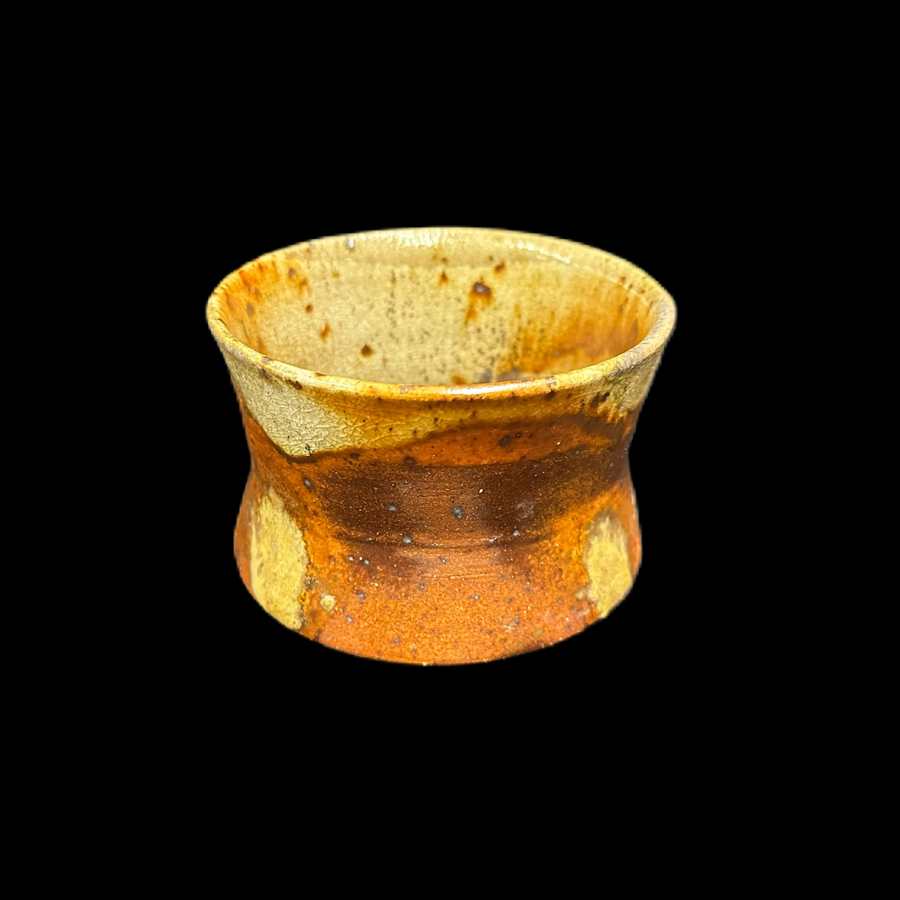
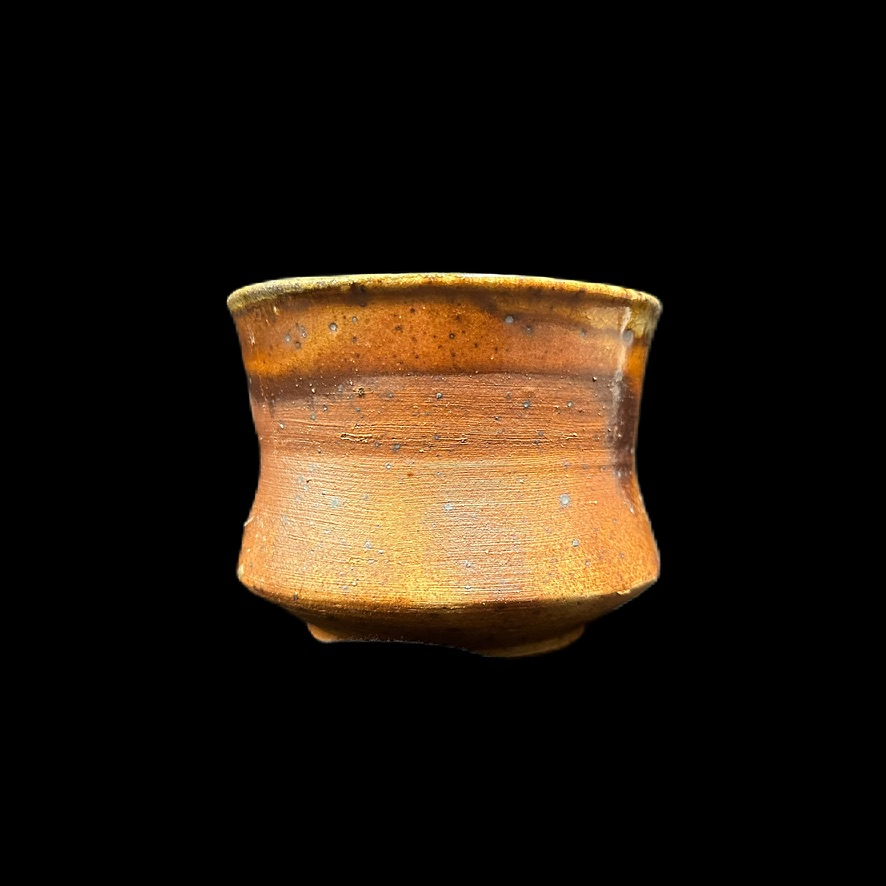

# About
- Title:  Angle Jar
- Date: 2023
- Place: New York
- Medium: Stoneware
- Dimensions: H 17cm x W 12cm x D 12cm
- Description: One of my ideas in woodfiring to place my jar in a saggar with slits on the side. I called this "Kinomo Saggar". My point is, usually saggar is something to protect from woodash, which I don't want shut down woodash but control how it comes. This piece show slight effect of mark along the slit but not enough. I'll continue exporing on this method.
- Tags: #cup #year2023 #woodfiring #kimonosaggar
- OrdNum:0

# Images

