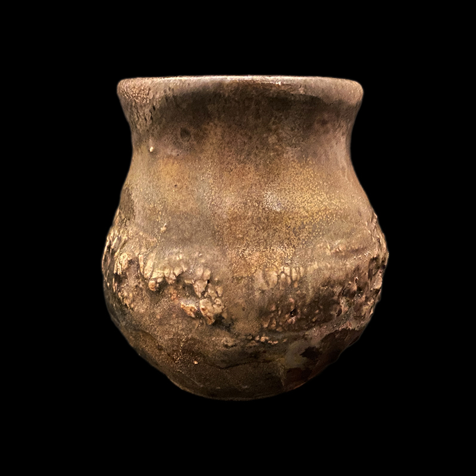

# About
- Title:  Umeboshi Jar
- Date: 2022
- Place: New York
- Medium: Stoneware
- Dimensions: H 16cm x W 8cm x D 8cm
- Description: Description: Surface has covered with kaolin layer to create the rocky texture. The bottom creates under cut shadow which was curved with a curving knife. Notice the contrast between the glassy smooth texture on top, rocky part in the middle, and raw red clay body surface around the foot. This jar has been created for specific purpose to store picked food for many years. This could be used to store Umeboshi (sour plum) or Kimchi (pickled spicy cabbage). Tested with silicone lid which perfectly fits.
- Tags: #jar#year2022 #woodfiring #shino #crackle  

# Images

