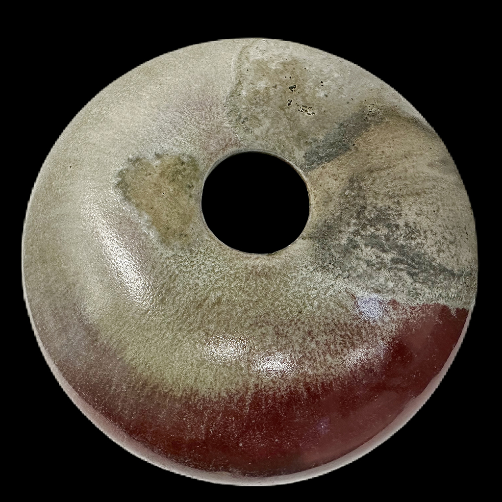
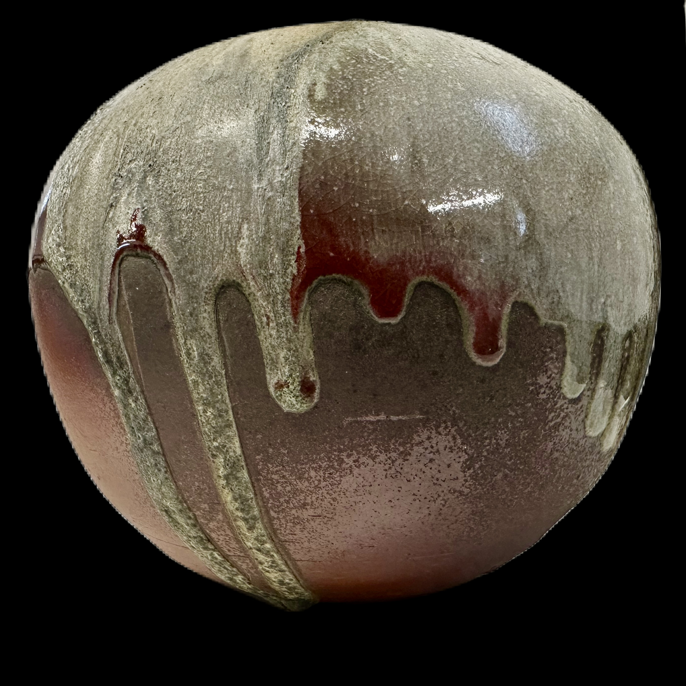
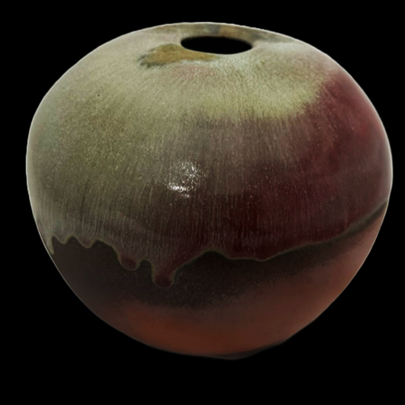
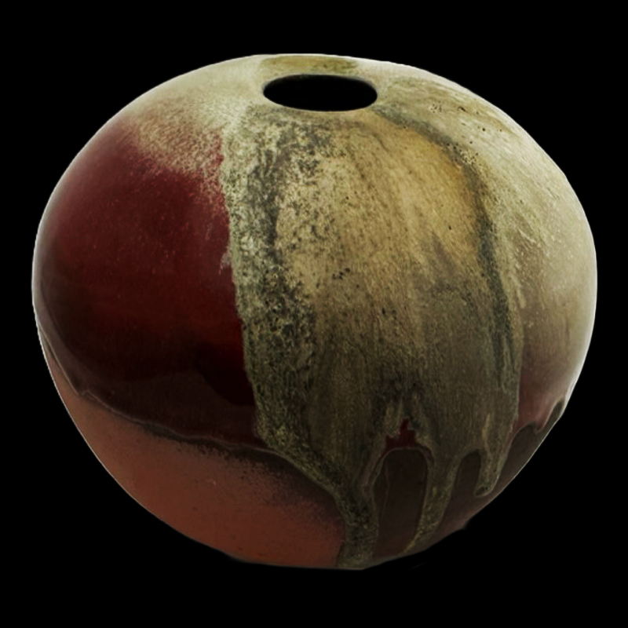
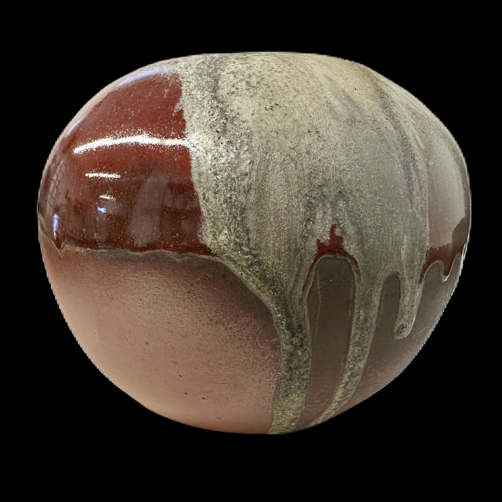
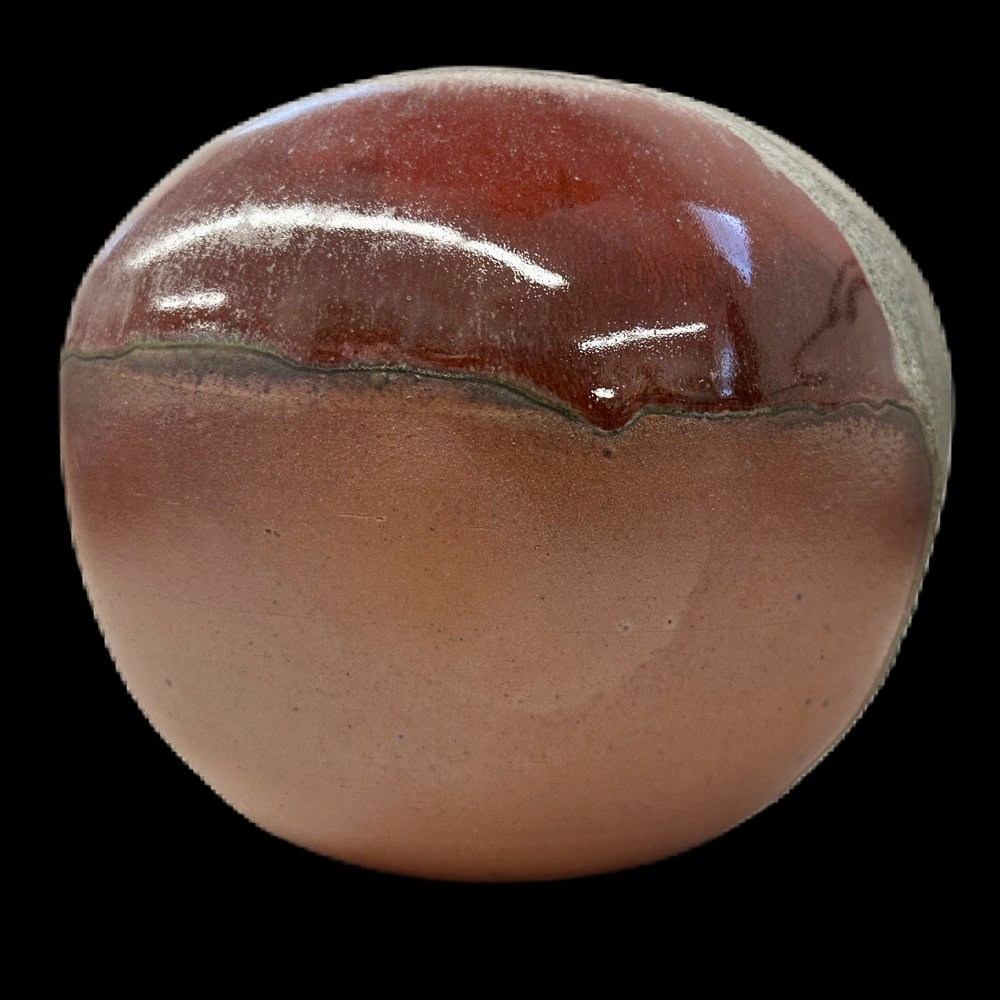
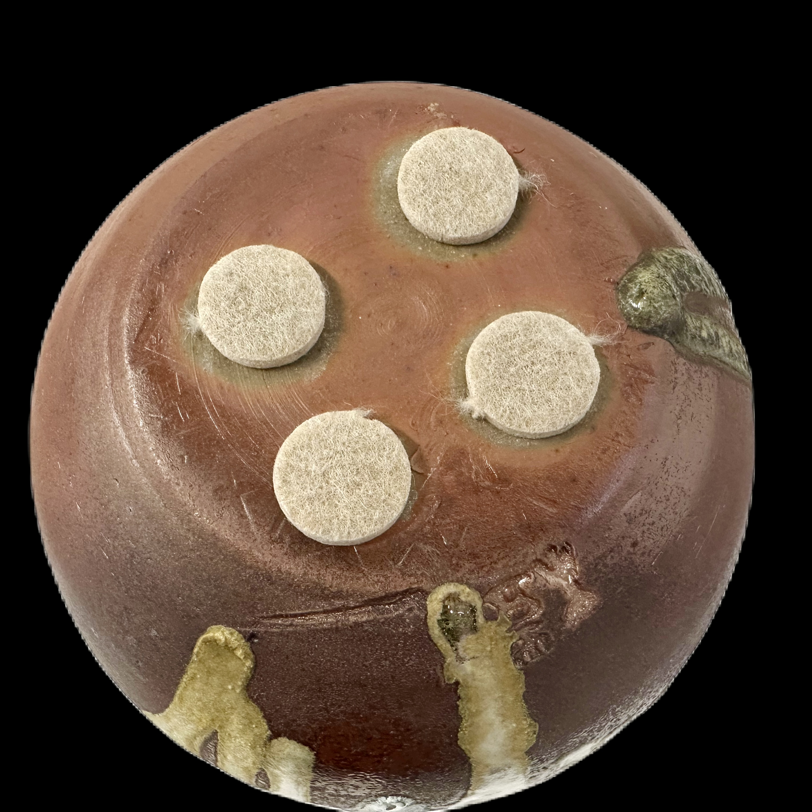

# About
- Title:  Erupu
- Date: 2023
- Place: New York
- Medium: Stoneware
- Dimensions: H 25cm x W 30cm x D 30cm
- Description: Erupu, which is named after "red" in Telugu, is a reflection of Kiichi's journey when he traveled around the southeast region of India where he encountered the vast natural landscape during the sunset. This earthy red toned moon vase features combination of natural wood ash and copper rich glaze, and they are creating a powerful blend of colors on toasty body.

- Tags: #jar #red  #year2023 #woodfiring #shino 
- OrdNum: 2000

# Images

 

      

# 3-D

