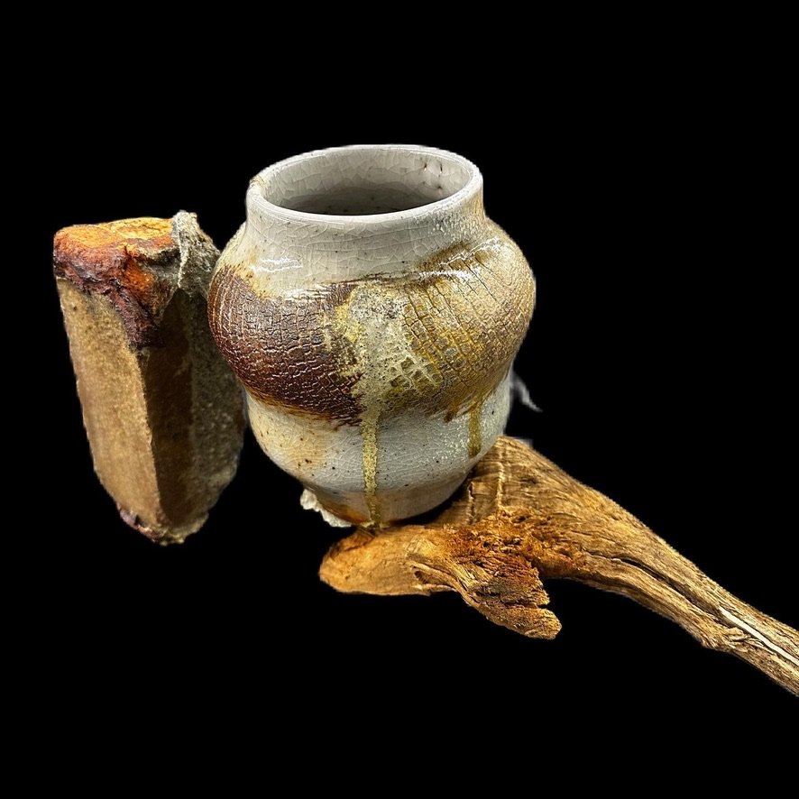
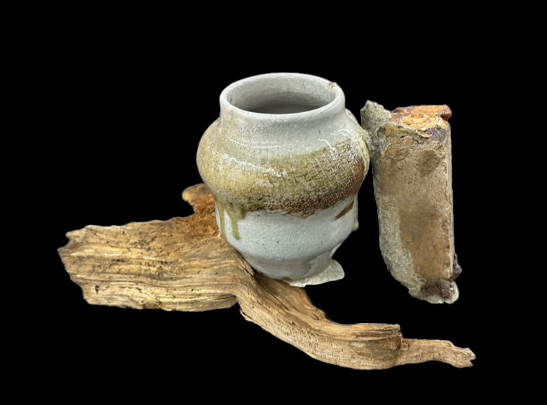
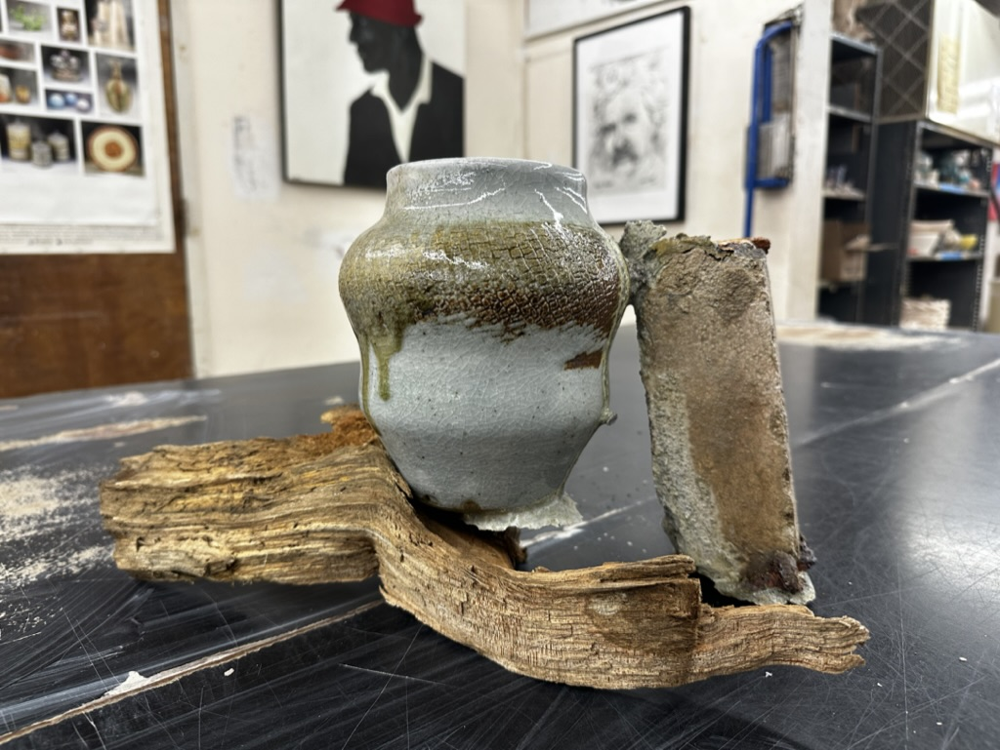
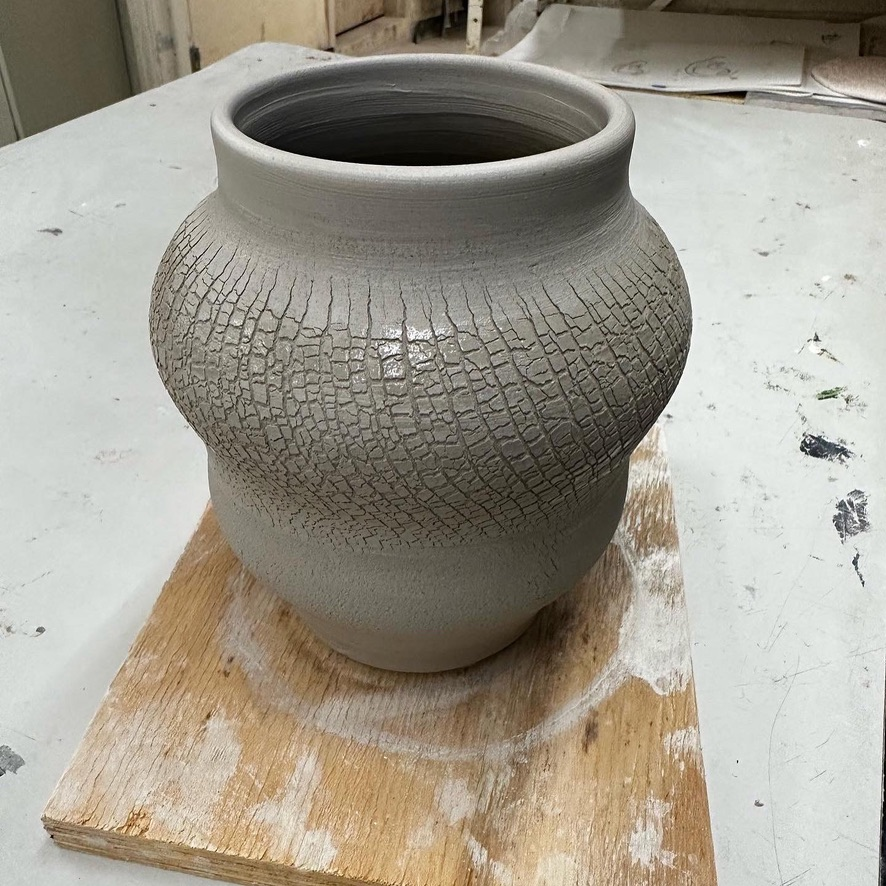
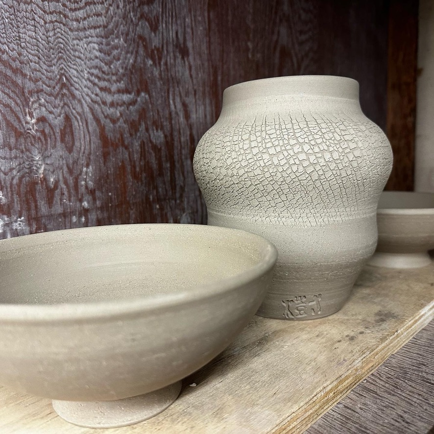
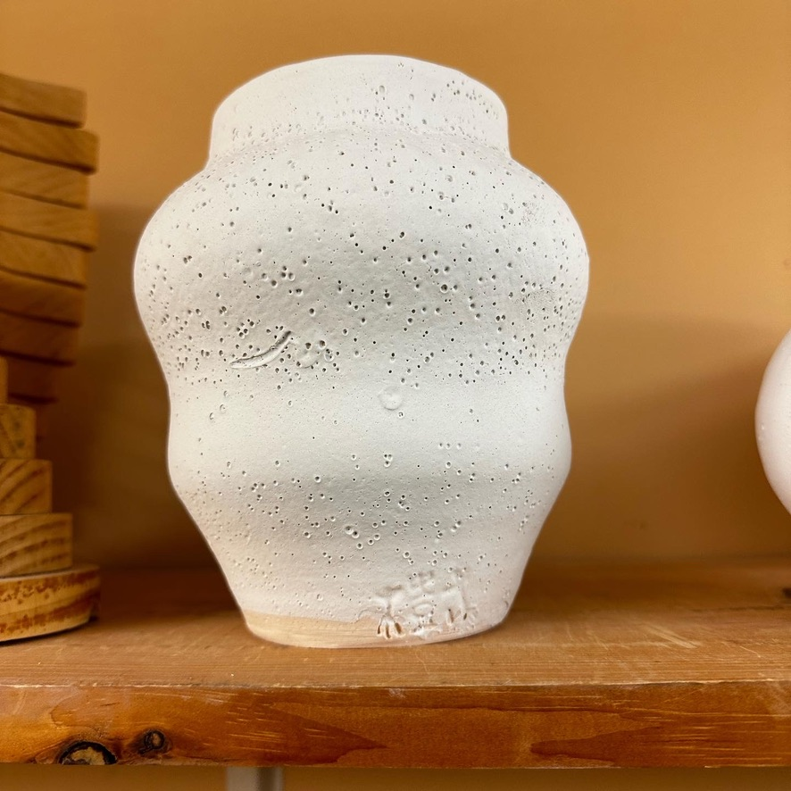
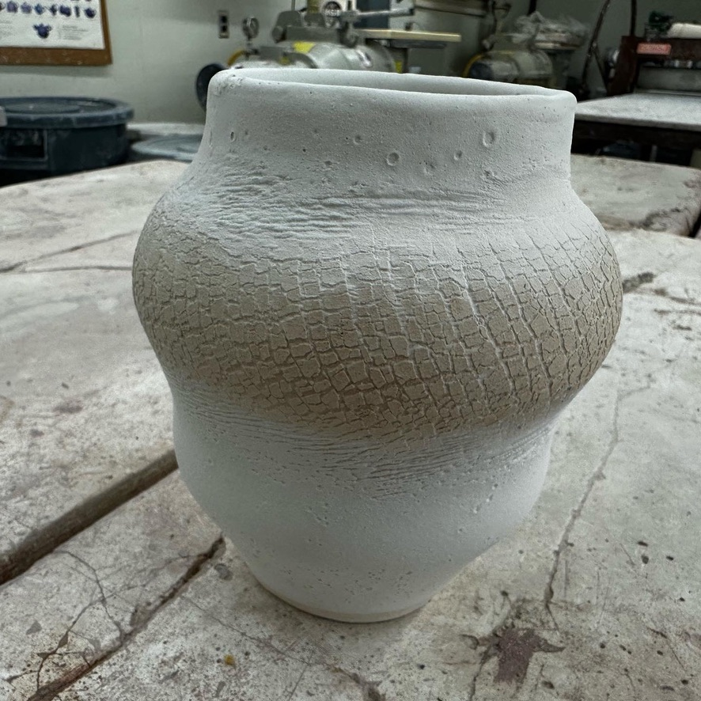

# About
- Title:  Little Beluga
- Date: 2022
- Place: New York
- Medium: Stoneware
- Dimensions: H 40cm x W 50cm x D 30cm
- Description: The jar exposes bold shoulder with its rough but glassy natural wood ash glaze. The neck part features the traditional white shino glaze surface where you might explorer dynamic crackle patterns. Kiichi has been actively involved to build and fire Anagama (Woodfire Kiln) at Trevor Youngberg’s Kiln Yard (Woodbridge, Conn.) , and this composit form develops strong architectural feel since all 3 pieces were built from the site. The new Anagama, Beluga-Gama, which he participated to build, fire bricks were donated by Long Island University. Although it revealed tremendous successful outcomes in the first firing itself, because of the nature of the first firing, a lot of drama happended inside the kiln. Especially, when it reached Cone 13 temperature (2450 F) after a few days, something from above landed on this pot. The attached brick is actual kiln shelf support. It was merged into the jar side by the kiln god - since wall material might have fallen; yes, it was the artist's descision to keep the brick to reflect the will of the kiln. With fallen wall material together on the side, the bottom wood piece was integrated underneath. Attatched wood foundation is the one of actual fuel for firing. Together with the jar, brick, and wood, the dynamic form creates synergy through the earthy materials of the jar.
- Tags: #vase #red  #year2022 #woodfiring #shino #crackle #exhibition 
- OrdNum:800

# Images

# 3-D

# Making

Traditional Shino Glaze

Brushed to expose the surface