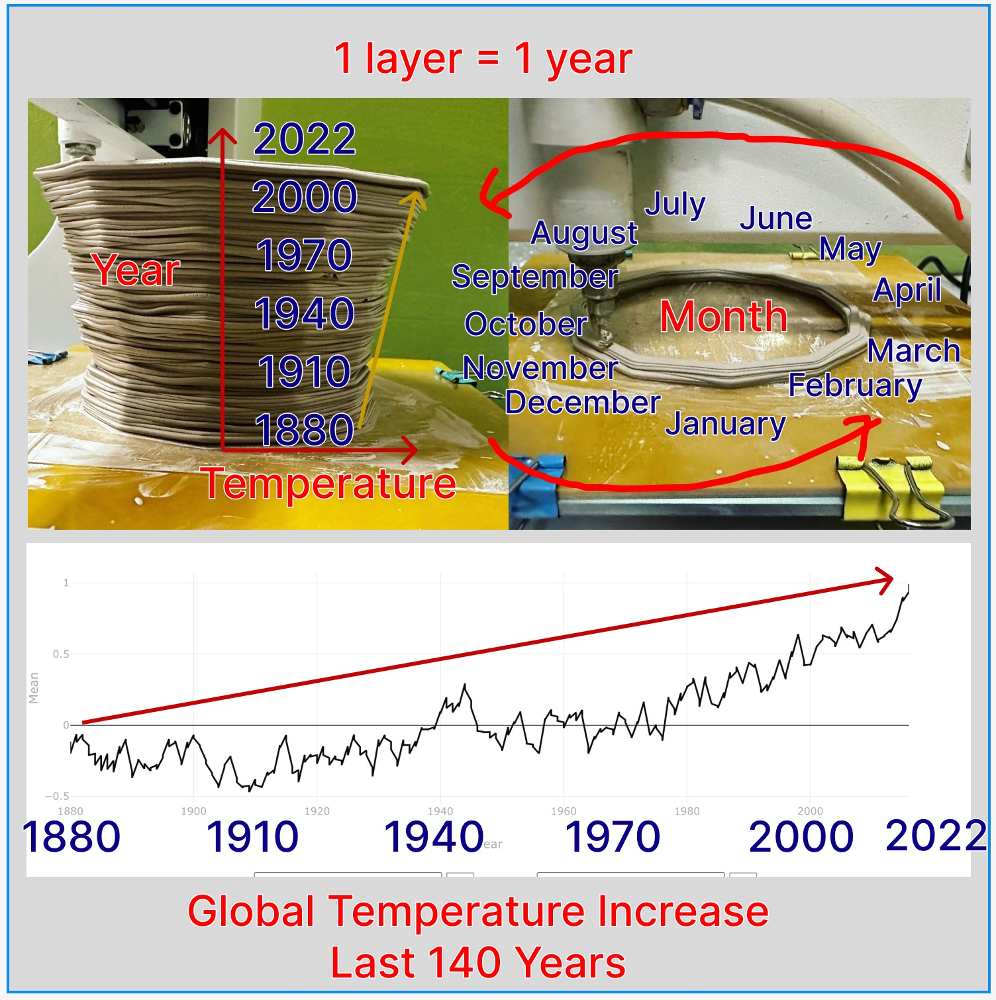
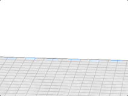
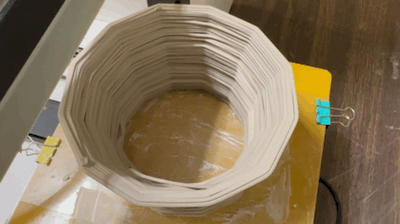
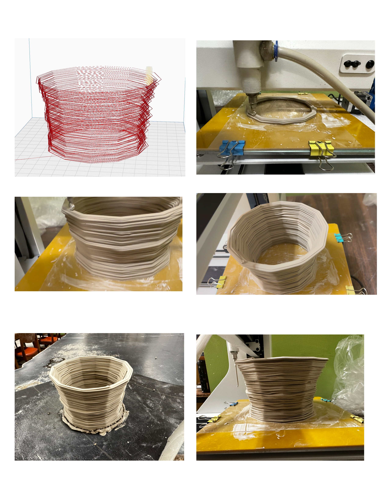
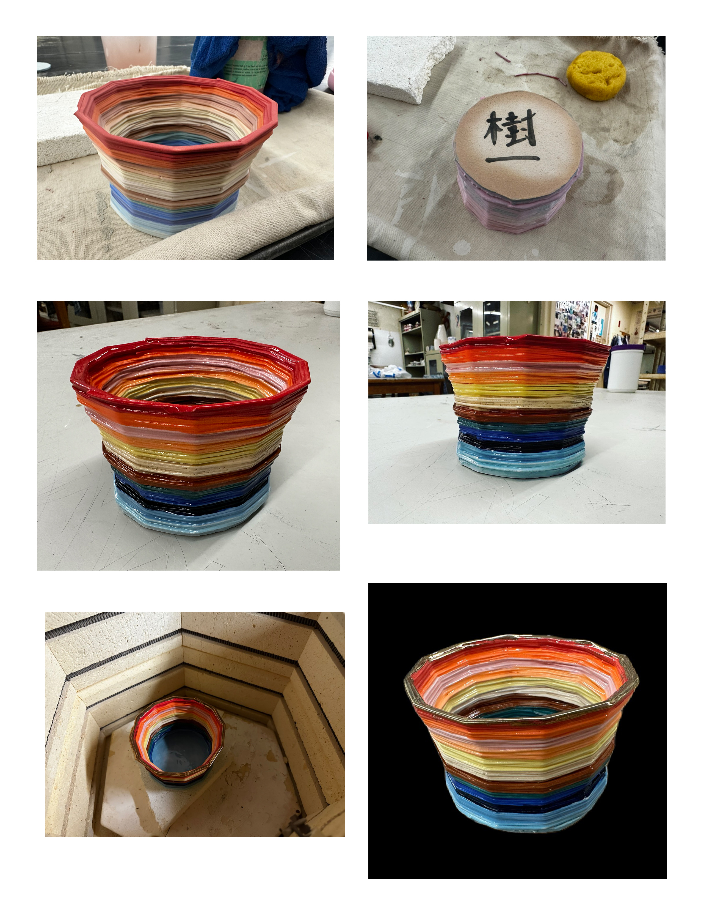
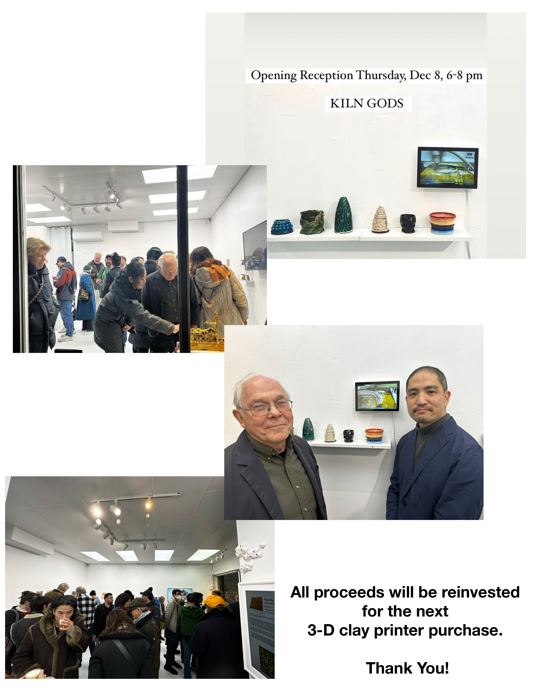

# About
- Title:  Not for Tomato Soup Cup
- Date: 2022
- Place: New York
- Medium: Stoneware
- Dimensions: H 10cm x W 10cm x D 10cm
- Description: 
- Tags: #cup #3dprint  #year2022 #underglaze #exhibition #sold #unlisted

# Extra Media and Footage

This is a unlisted page which is dedicated for the owner of our first successful 3-D print project.  I would like to add more commentary and extra bonus footage media in USB thumb drive inside the booklet. 

For official listing and images, please look at https://www.kiichitakeuchi.com/works/2022/3dprint/not-for-tomato-soup-cup/not-for-tomato-soup-cup 

# Footage Slideshow Videos

These are different versions of slideshow movies from collected images and videos. I try to present how the shape of cup created from the global warming data over last 140 years, and then there are slides of each steps: simulating, printing, painting, plus extra gold rim finishing, and the show at Space 776.

## Short Version

https://youtu.be/QMrf6gH6vAA

## Long version 1

https://youtu.be/IZnplTXmIg8

## Long version 2

https://youtu.be/V5gQwYhMpbU

# Images

# Permalink

https://kiichitakeuchi.com/works/unlisted/not-for-tomato-soup-cup

This work is unique in terms of print in 3-D directly from data. I used to work with my thesis advisor, Christopher League who was my thesis advisor in Computer Science at LIU Brooklyn, and Patrick Kennely who was my thesis advisor in Earth Science at LIU Post. When we launched our first Online Campus Program, Mobile Geographic Information Systems, in 2012, we discuss some ideas how we can visualize climate data. Later on, Christopher League published an award winning article about the tecnique ([PDF](https://www.tandfonline.com/doi/full/10.1080/00087041.2018.1533291) ) NASA recently posted another climate change video from the data on Twitter. 

When we got our first 3-D printer, I thought about building our own design. We are not media art speclists who can design 3-D model. I needed to come up with some idea to construct our own model. After all, I figured out the way to built a program so that I can directly generate code for 3-D clay printer. 

